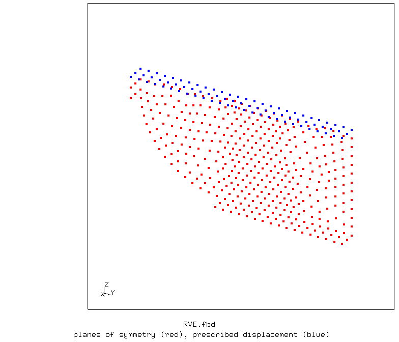
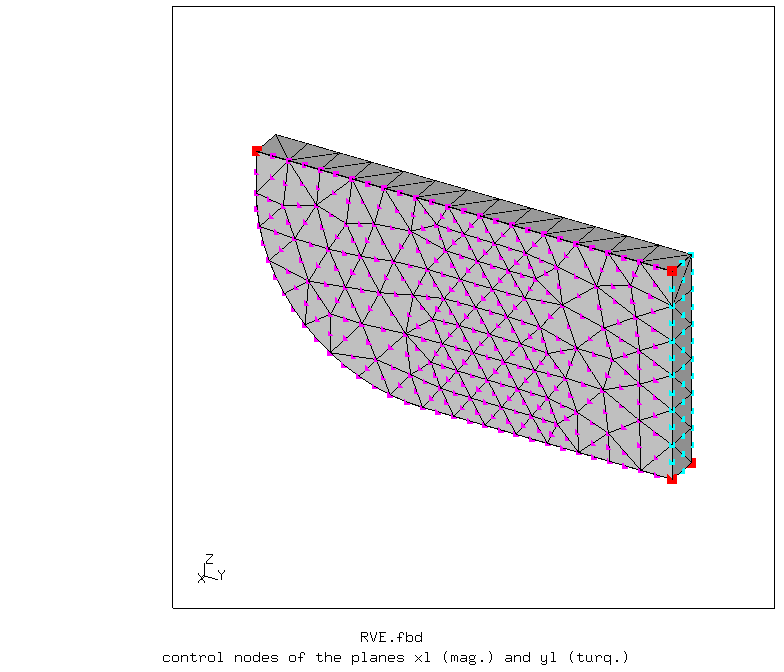
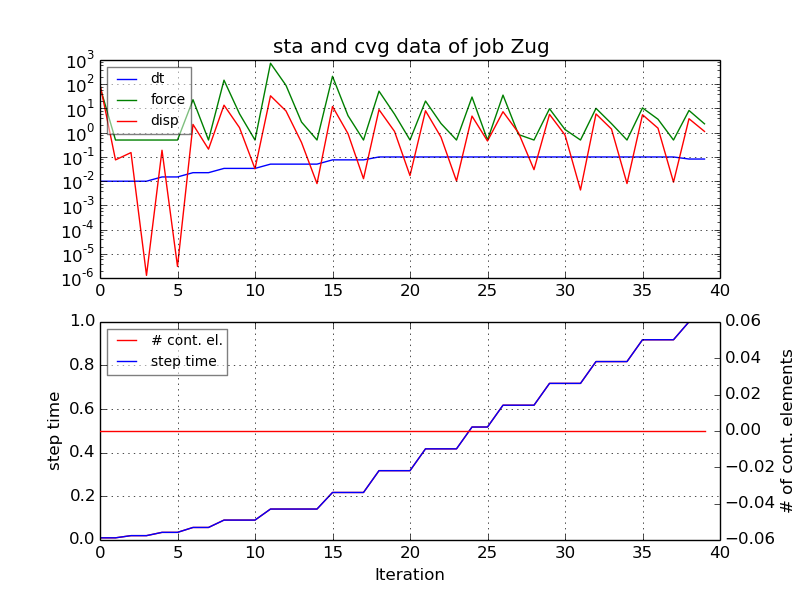
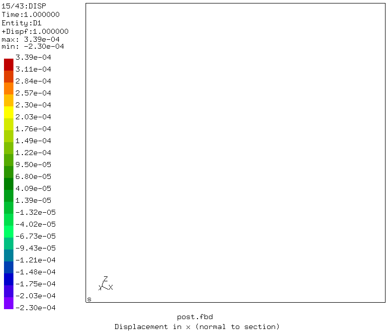
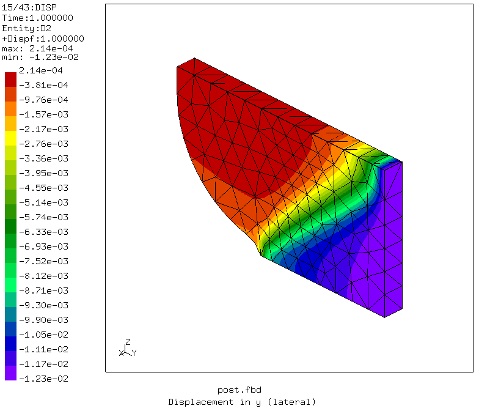
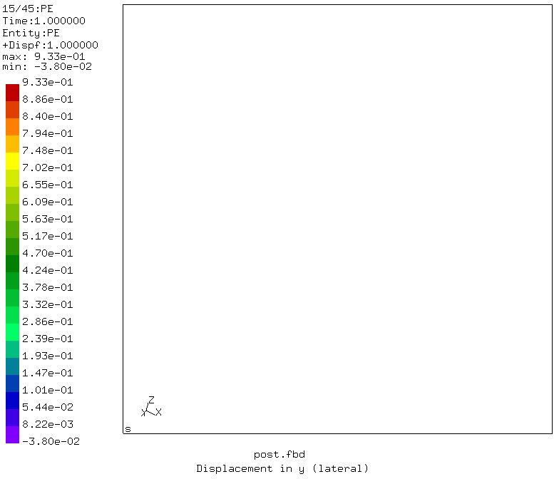
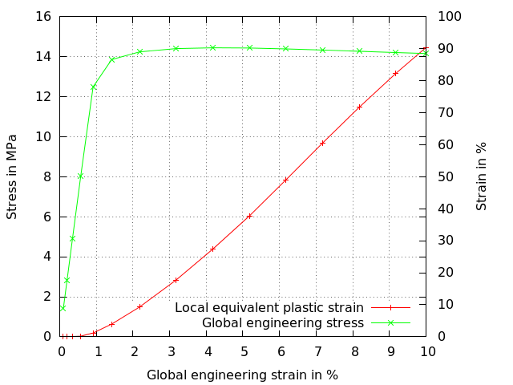

# Tensile Test of FDM layers, plane and orthogonal boundaries
Tested with CGX 2.16 / CCX 2.15

Tensile test of unidirectional FDM (3D printed) layers with load application perpendicular to the printing plane. The layed roads only partially bond between each other and to the layer below. The localized strains at the resulting notches lead to material failure at global strains much below the maximum elongation of the base material (embrittlement).

The test specimen is a quarter unit cell out of an infinite Block of layers. This is not restricting the deformation as long as no global shear is to be applied. A uniaxial tensile test can be performed without restricting the overall transverse strain.

+ Large displacements
+ Plasticity
+ The structure is parametrized using CGX valu due to it's simplicity
+ Enforced brick shape of the unit cell using MPCs
+ Handover of load parameters to the CCX file
+ Handover of parameters to the gnuplot file


File                     | Contents    
:-------------           | :-------------
[RVE.fbd](RVE.fbd)       | Pre-processing script for CGX (parametrized with valu commands)     
[post.fbd](post.fbd)     | Post-processing script for CGX (stress-strain curve and deformed plot)
[verify.fbd](verify.fbd) | Post-processing script for CGX (displacement plots) |
[pe.gnu](pe.gnu)         | Gnuplot control script
[Zug.inp](Zug.inp)       | CCX input
[test.py](test.py)       | Python script to run the full simulation

## Preprocessing

```
> cgx -b RVE.fbd
```

The geometry consists of brick with a fillet along a single edge, representing a quarter section of an FDM road.

The mesh is controlled by a global node distance.

| Parameter | Value | Meaning |
| :------------- |  :------------- | :------------- |
| `lx` | 0.02 | length in axial direction in mm |
| `ly` | 0.5 | road width in mm |
| `lz` | 0.25 | layer thickness in mm |
| `rad` | 0.1 | fillet radius |
| `le` | 0.01 | node distance on edges |
| `ez` | 0.1 | global engineering strain in z direction |


Boundary conditions:
* ux = 0 at x = 0 (symmetry boundary)
* uy = 0 at y = 0 (symmetry boundary)
* uz = 0 at z = 0 (symmetry boundary)
* uz = ez/100*lz at z = lz/2 (prescribed displacement)
* ux all equal at x = lx (parallel to yz plane)
* uy all equal at y = ly/2 (parallel to xz plane)



Compared to the less sophisticated [example](RVE/PlanarSlide), the model requires only a fraction (a single layer) of the elements in x-direction and just one quarter of the section.

## Solving

```
> ccx Zug
> monitor.py Zug
```
The second command generates a convergence history plot of the solution.


## Postprocessing

First, let's verify the boundary conditions.
* Uniform UX at x = lx
* Uniform UY at y = ly

```
> cgx -b verify.fbd
```





Now let's create a stress-strain curve and an expanded plot of the equivalent plastic strain.
```
> cgx -b post.fbd
```




You can generate the curves separately using the commands:

```
> dat2txt.py Zug
> gnuplot pe.gnu
```
