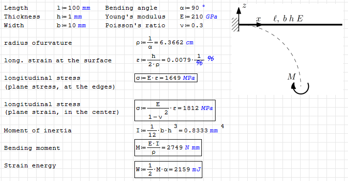

# 90°-Bending of an Elastic Strip

This example demonstrates the application of prescribed rotations to node sets.
The structure is an elastic flat strip of dimensions 100x10x1 mm³. One end is
fixed and one end is rotated by 90°. The strip thus is bent into a quarter
circle. We investigate the following cases:

* Beam model
* Shell model
* Solid model with mean rotation constraint
* Solid model with rigid body constraint.

| Model    | CGX input     | CCX input |
| :------- | :------------- |:---|
| Beam | [b.fbd](b.fbd) | [b.inp](b.inp) |
| Shell | [sh.fbd](sh.fbd) | [sh.inp](sh.inp) |
| Solid, mean rotation MPC | [sm.fbd](sm.fbd) | [sm.inp](sm.inp) |
| Solid, rigid body MPC | [sr.fbd](sr.fbd) | [sr.inp](sr.inp) |


| Auxiliary CGX Files                        | Contents                                      |
| :-------------              | :-------------                                |
| [def-plot.fbd](def-plot.fbd)| deformation plot                          |
| [view.fbd](view.fbd)| view settings                         |
## Reference solution
Click the image below to open a life SMath worksheet

[](http://smath.info/cloud/worksheet/7PsVsa4o)


# Beam Model
In CGX, b3 elements are specified. This results in B23R elements in the CCX input. These are internally expanded into C3D20R.

The rotation is applied as constraint to dof 5 of the node at the free end of the beam. With the default convergence control settings, only 12% of the specified rotation are reached.
```
> cgx -b b.fbd
```
The script contains the pre-processing, solution and post-processing.


# Shell Model
In CGX, qu8 elements are specified. This results in S8R elements in the CCX input. These are internally expanded into C3D20R.

The rotation is applied as constraint to dof 5 of the nodes at the free end of the strip. The solution converges very well. Due to the large rotations, only invariant stress measures like v. Mises or principal stresses are useful.
```
> cgx -b sh.fbd
```


# Solid Model
In CGX, he20r elements are specified. This results in C3D20R elements in the CCX input.

## Mean Rotation MPC
The rotation is applied using the mean rotation multipoint constraint (MPC). This couples the mean rotation of a cloud of nodes to the first dof of a reference node. The initial position of that node indicates the axis of rotation.

In CGX, the required input for a rotation of 90° about the y-axis can be generated using the command
```
send rot abq mpc 90 0 1 0
```
This generates the files
* [rot.mpc](rot.mpc) with the ref node definition and the `*mpc` block (model data)
* [rot.bou](rot.bou) with the `*boundary` block (step data)

Run the analysis:
```
> cgx -b sm.fbd
```
At 28% of the specified deformation, the incremental time becomes too small and the solution is stppped.


## Rigid Body Constraint
The rotation is applied using a rigid body constraint. The right end is rigidly coupled to a rotation control node. In the pre-processing, it is useful to create the control node with a fixed number before meshing.

Run the analysis:
```
> cgx -b sr.fbd
```
At 74% of the specified deformation, the incremental time becomes too small and the solution is stppped.


