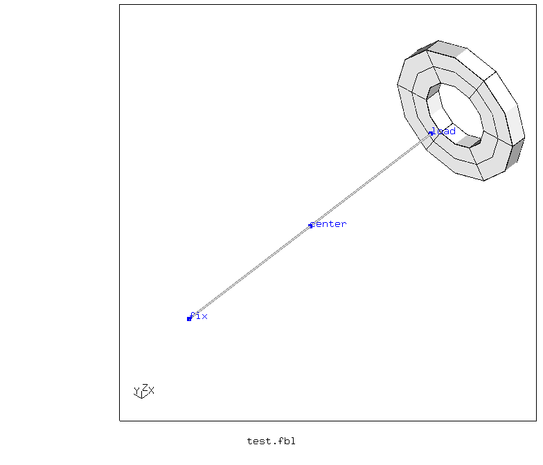

># Coupling with beams

Tested with CGX 2.19 / CCX 2.19

+ Test of how to couple structures to beam nodes in an average sense
+ Reference nodes with and without knots

Observations:
+ None of the methods can couple the rotations of a beam node (knot or not a knot) to a surface.
+ Kinematic coupling pin-joines the reference node to the surface.


File                          | Contents    
:-------------                | :-------------
[test.fbl](test.fbl)          | Top level CGX script, full test program
[run.fbl](run.fbl)            | CGX script, subprogram for a single simulation
[modal.inp](modal.inp)        | CCX input
[test.py](test.py)            | Python script to run the full simulation

Name                  | Coupling      | Ref node | dofs
:----                 | :----         | :----    | :---
c_kin_load_123        | kinematic     | normal   | 1-3
c_kin_center_123      | kinematic     | knot     | 1-3

The model consists of a beam and a disk with hole.
The beam is fixed at x=0 (all dofs). The adjacent face of the disk is coupled either to the "center" node (which has a knot due to inverse beam normals at both sides) or to the
"load" node at the free end (which is an ordinary node).

Parameter | Value | Description
:--       | :--   | :---
le        | 100   | Length in mm
ri        | 10    | Inner radius in mm
ra        | 20    | Outer radius in mm
td        | 5     | Thickness of the ring in mm
dist      | 10    | Offset of the ring from the beam end in mm  
num       | 10    | Number of mode shape movies to generate



A frequency analysis is performed to see how the coupling works.

```
> cgx -b test.fbl
```
## Results
### c_kin_load_123

Kinematic coupling to the end node. The disk is pin-joined to the ref node and can spin freely about that point. This is because the end node doesn't have a knot.


### c_kin_center_123

Kinematic coupling to the center node. The disk is pin-joined to the center node and can spin freely about that point. The rotation, however, is not coupled.


