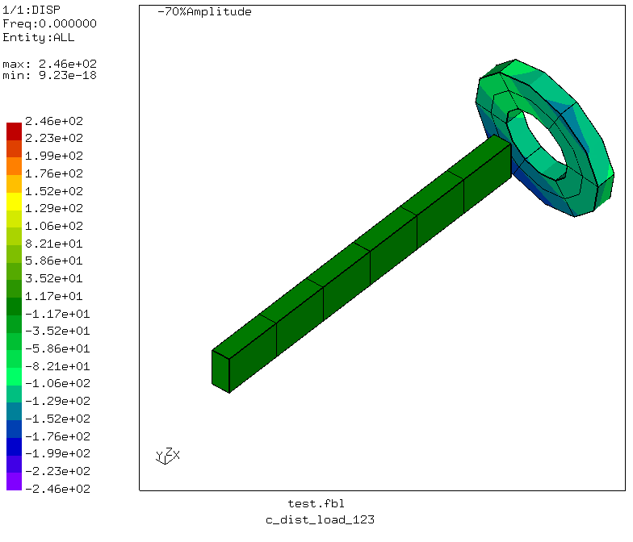
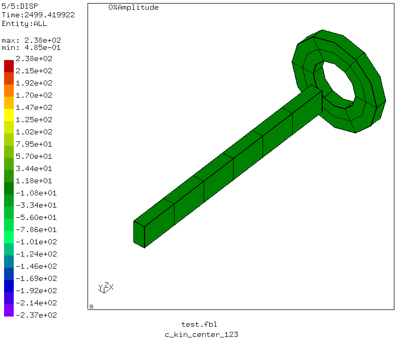

># Coupling with beams

Tested with CGX 2.12.1/CCX 2.12

+ Test of coupling with beam nodes
+ Distributing and kinematic coupling
+ Distributing coupling of translations and rotations or translations only
+ Reference nodes with and without knots


File                           | Contents    
 :-------------                | :-------------
 [test.fbl](test.fbl)          | Top level CGX script, full test program
 [run.fbl](run.fbl)            | CGX script, subprogram for a single simulation
 [modal.inp](modal.inp)        | CCX input

Directory             | Coupling      | Ref node | dofs
:----                 | :----         | :----    | :---
c_dist_load_123       | distributing  | normal   | 1-3
c_dist_load_123456    | distributing  | normal   | 1-6
c_dist_center_123     | distributing  | knot     | 1-3
c_dist_center_123456  | distributing  | knot     | 1-6
c_kin_load_123        | kinematic     | normal   | 1-3
c_kin_center_123      | kinematic     | knot     | 1-3

The model consists of a beam and a disk with hole.
The beam is fixed at x=0 (all dofs). The adjacent face of the disk is coupled either to the "center" node (which has a knot due to inverse beam normals at both sides) or to the
"load" node at the free end (which is an ordinary node).


A frequency analysis is performed to see how the coupling works.

```
> cgx -b test.fbl
```
## Results

### c_dist_load_123

Distributing coupling of the translations to the end node. Ref node and CG of the coupled face translate synchronously. The rotation of the disk is free.



### c_dist_center_123

Distributing coupling of the translations to the center node. Ref node and CG of the coupled face translate synchronously. The rotation of the disk is free.

For distributing coupling of translations it does not matter if the ref node has a knot.


### c_dist_load_123456

Distributing coupling of the translations and rotations to the end node. The end node can't take the rotations. There is a lot of hour-glassing zero frequency modes. These are also active in static simulations and spoil the convergence. Mode 10 is a rigid body mode indicating the failure of rotational
coupling. Due to the absence of a knot at the ref node, this is to be expected.


### c_dist_center_123456

Distributing coupling of the translations and rotations to the end node. The end node can't take the rotations. There is a lot of hour-glassing zero frequency modes. These are also active in static simulations and spoil the convergence. Mode 10 is a rigid body mode indicating the failure to couple the rotations to the ref node even if there is a knot.


### c_kin_load_123

Kinematic coupling to the end node. The disk is pin-joined to the ref node and can spin freely about that point. This is because the end node doesn't have a knot.


### c_kin_center_123

Kinematic coupling to the center node. The disk is attached to the ref node like a rigid body (in fact, only the coupling face is rigid).



