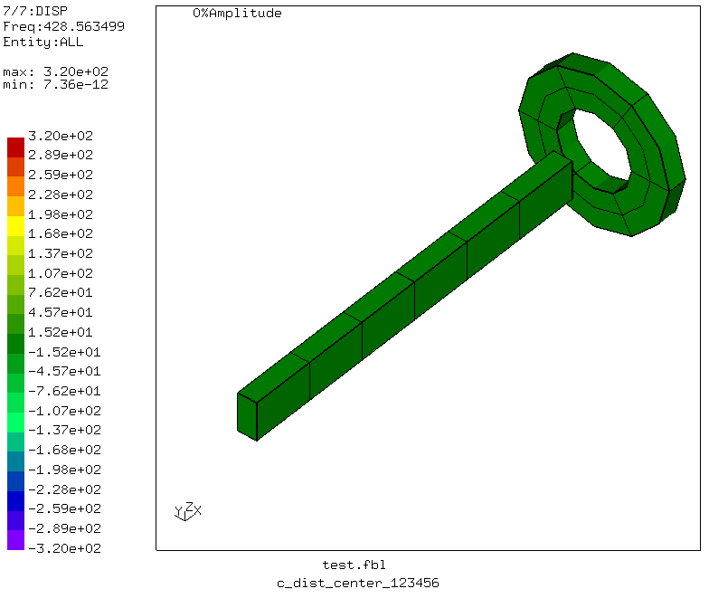
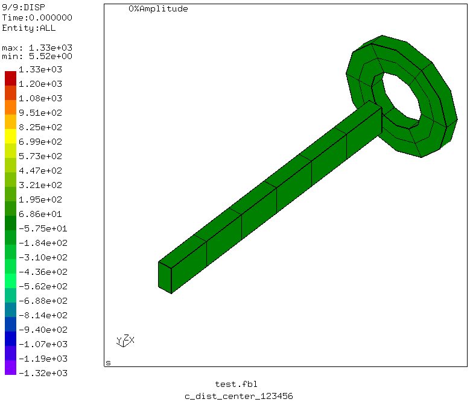

># Coupling with beams

Tested with CGX 2.15 / CCX 2.15

+ Test of coupling with beam nodes
+ Distributing and kinematic coupling
+ Distributing coupling of translations and rotations or translations only
+ Reference nodes with and without knots

Issues:
+ distributing coupling of rotations leads to hour-glassing modes, which aren't there if only
  the translations are coupled. This is independent of the presence of a knot at the ref node.
+ kinematic coupling doesn't trigger the generation of a knot at the ref node. To couple the
  rotations, a knot has to be enforced by other means (e.g. by having adjacent beam elements with
    different normals).

Feature request:
+ Distributing coupling such that the CG of the surface and the ref node are coupled rigidly (to allow for a distant force or a distant support without constraining the deformation of the coupled surface).


File                          | Contents    
:-------------                | :-------------
[test.fbl](test.fbl)          | Top level CGX script, full test program
[run.fbl](run.fbl)            | CGX script, subprogram for a single simulation
[modal.inp](modal.inp)        | CCX input
[test.py](test.py)            | Python script to run the full simulation

Name                  | Coupling      | Ref node | dofs
:----                 | :----         | :----    | :---
c_dist_load_123       | distributing  | normal   | 1-3
c_dist_load_123456    | distributing  | normal   | 1-6
c_dist_center_123     | distributing  | knot     | 1-3
c_dist_center_123456  | distributing  | knot     | 1-6
c_kin_load_123        | kinematic     | normal   | 1-3
c_kin_center_123      | kinematic     | knot     | 1-3

The model consists of a beam and a disk with hole.
The beam is fixed at x=0 (all dofs). The adjacent face of the disk is coupled either to the "center" node (which has a knot due to inverse beam normals at both sides) or to the
"load" node at the free end (which is an ordinary node).

Parameter | Value | Description
:--       | :--   | :---
le        | 100   | Length in mm
ri        | 10    | Inner radius in mm
ra        | 20    | Outer radius in mm
td        | 5     | Thickness of the ring in mm
dist      | 10    | Offset of the ring from the beam end in mm  
num       | 10    | Number of mode shape movies to generate


A frequency analysis is performed to see how the coupling works.

```
> cgx -b test.fbl
```
## Results

### c_dist_load_123

Distributing coupling of the translations to the end node. Ref node and CG of the coupled face translate synchronously. The rotation of the disk is free.


### c_dist_center_123

Distributing coupling of the translations to the center node. Ref node and CG of the coupled face translate synchronously. The rotation of the disk is free.

For distributing coupling of translations it does not matter if the ref node has a knot.


### c_dist_load_123456

Distributing coupling of the translations and rotations to the end node. The end node can't take the rotations.  . Due to the absence of a knot at the ref node, this is to be expected.


### c_dist_center_123456

Distributing coupling of the translations and rotations to the center node. Even though it is a knot, coupling of the rotations seem to fail.



### c_kin_load_123

Kinematic coupling to the end node. The disk is pin-joined to the ref node and can spin freely about that point. This is because the end node doesn't have a knot.


### c_kin_center_123

Kinematic coupling to the center node. The disk is pin-joined to the center node and can spin freely about that point. The rotation, however, is not coupled.


