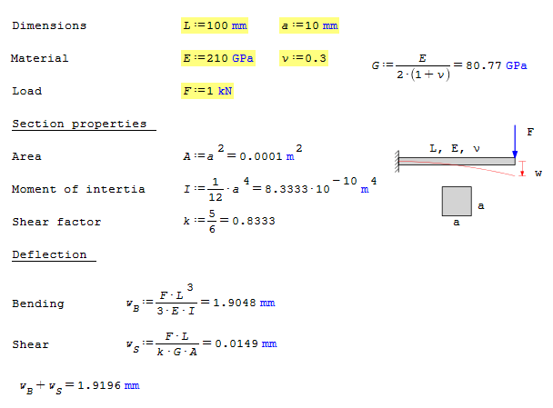
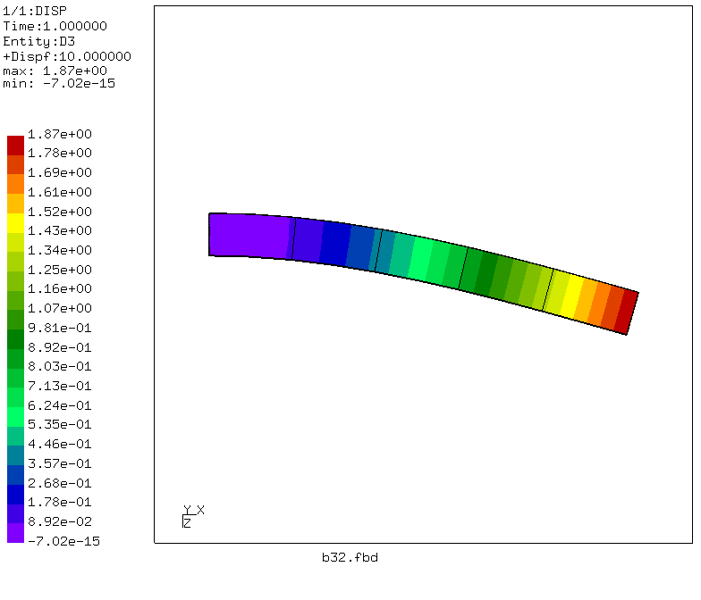
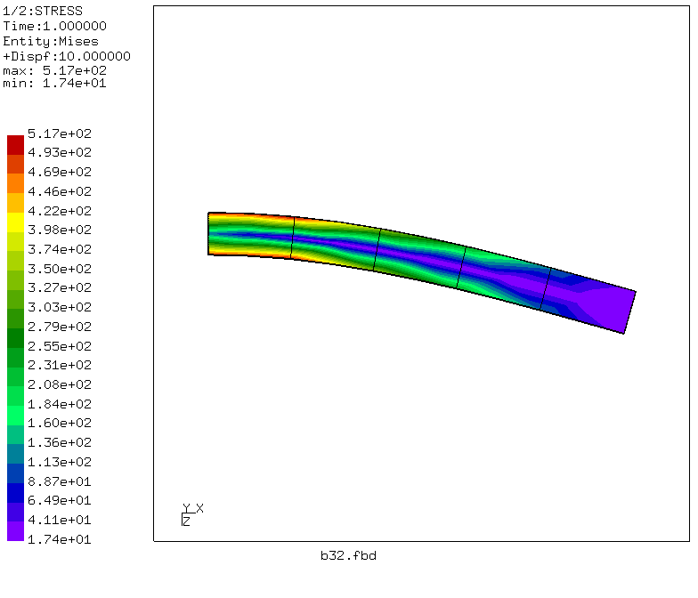
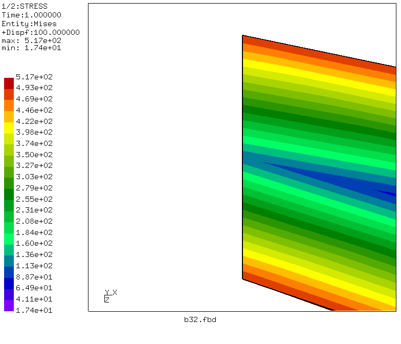
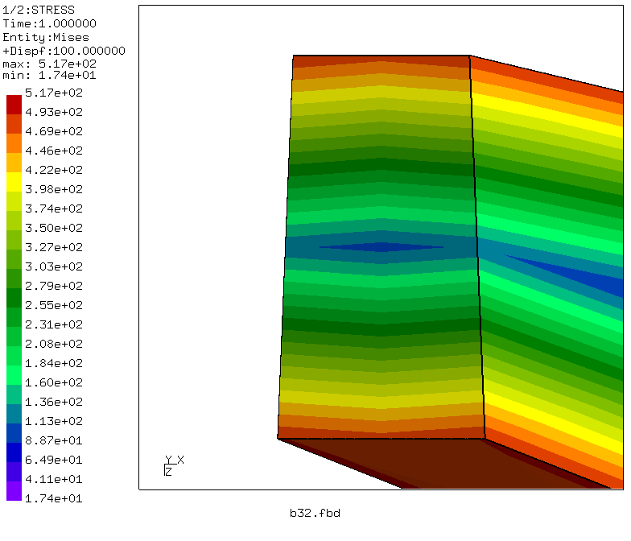
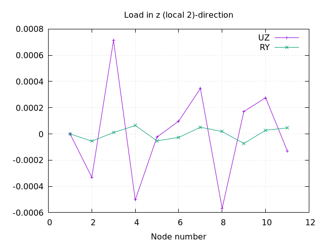
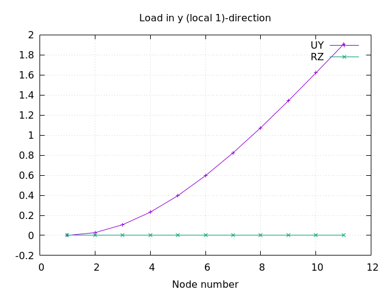

# Beam Sections

Tested with CGX 2.19 / CCX 2.19

+ Test of beam elements

File                           | Contents    
:-------------                 | :-------------
[b32.inp](b32.inp)             | CCX input for B32 element
[b32.fbd](b32.fbd)             | CGX pre/post input for B32 element
[u1general.inp](u1general.inp) | CCX input for user element U1 with general beam section
[u1.plt](u1.plt)               | Gnuplot script for the U1 example
[test.py](test.py)             | Python script to run the full simulation


## Cantilever beam with point load

Structure: Cantilever beam (length 100 mm, square section 10 x 10 mm) with a point load of 1 kN at the free end. Material is
steel with E = 210 GPa and nu = 0.3.

### Reference solution

Click the image below to open a life worksheet:
[](https://en.smath.info/cloud/worksheet/RGoTsp3s)

### Beam element b32r
This element is internally expanded into C3D20R solid elements. Prescribed rotations are internally converted into mean rotation MPCs.

```
> cgx -b b32.fbd
```


For the given mesh density, the displacement is 3% lower than the reference value and converges to it for higher density.



### User element U1 with general section

This element is mentioned in the CCX handbook version 2.15 in section 6.2.46. The input is adapted from the official example `userbeam.inp` with 10 elements instead of 1 and with symmettric cross section. The local 1 axis is in y-direction (second data line of the `*beam section` card)

```
*ELEMENT, TYPE=U1, ELSET=Eall
1,      1,      2,
...
*USER ELEMENT,TYPE=U1,NODES=2,INTEGRATION POINTS=2,MAXDOF=6
...
*BEAM SECTION,ELSET=Eall,MATERIAL=EL,SECTION=GENERAL
100.,833.3,0.,833.3,0.8333
0.,1.,0.
...
```
For meshing you can specify be2 elements in CGX and then rename the element type to U1 in the mesh file.
In the given example, the mesh was generated manually directly in the INP file.

The simulation consists of two steps:

+ Load in z-direction
+ Load in y-direction

Run the analyis, extract the data and plot the displacement:
```
> ccx u1General
> sed -n '4,14 p' u1General.dat > u1-3.txt
> sed -n '41,51 p' u1General.dat > u1-2.txt
> gnuplot u1.gpl
```
The field results (FRD) are unusable. They neither contain the mesh nor any results.
For results checking you have to rely on the DAT file.

The following image shows the displacement in load direction and the rotation about the the transverse direction for both loading conditions. Both should give the same result, as the beam section is symmetric.





Obviously, the beam element requires the load to go in local 1-direction. The results for local 2-direction seem to be numeric rubbish. Yet, these results are identical for both steps (load directions).
