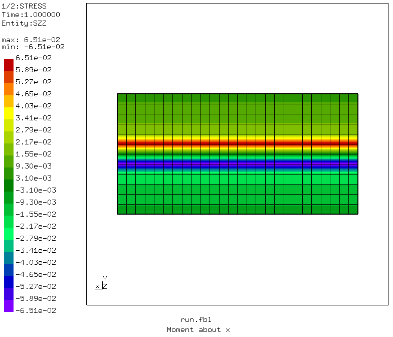
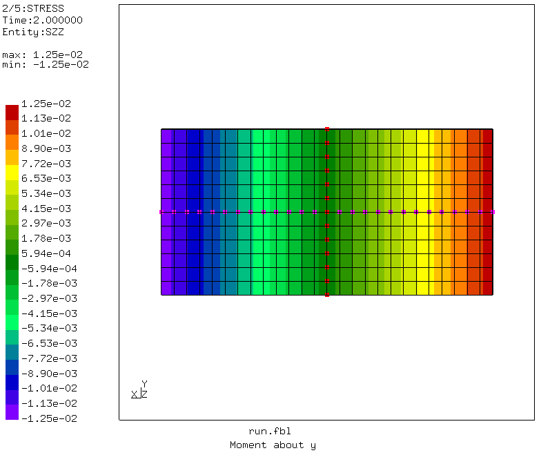
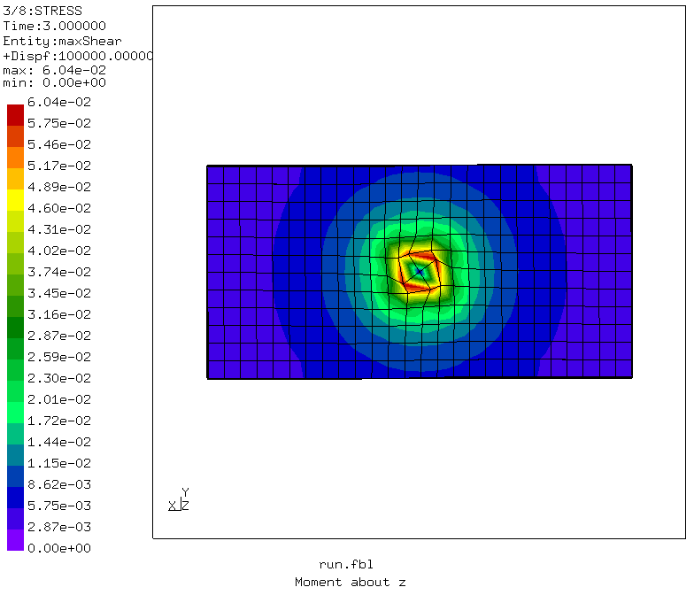
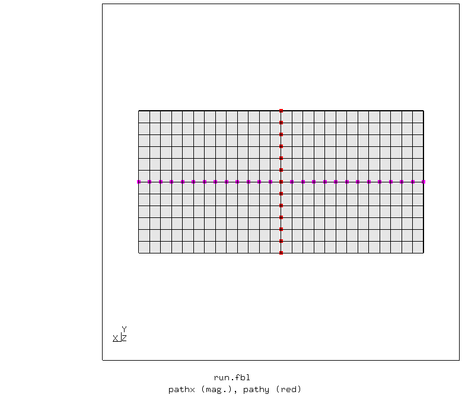
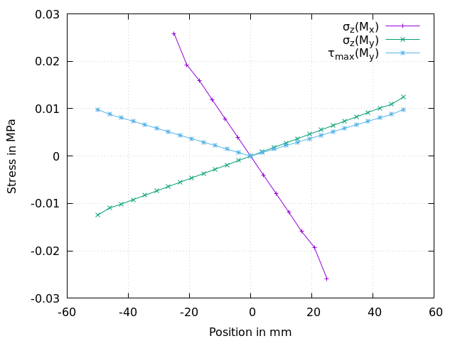

# Stress distribution with distributing coupling

Tested with CGX 2.16 / CCX 2.15

+ Test of distributing coupling
+ Stress distribution for applied moments

File                          | Contents    
:-------------                | :-------------
[run.fbl](run.fbl)            | CGX script, full simulation
[solve.inp](solve.inp)        | CCX input
[path.gpl](path.gpl)          | Gnuplot input for path plots
[test.py](test.py)            | Python script to run the full simulation

The model consists of a thin rectangular plate. The bottom at z=0 is fixed (all dofs constrained).
To the upper surface, moments are applied via distributing coupling.

For path plots of the stress distribution, appropriate node sets are generated.

The plots of the normal stress show the load distribution for bending moments, the plots of the max shear stress show the load distribution in torsion.


```
> cgx -b run.fbl

```




The stress profiles are hyperbolic with distance from the center of gravity (a linear distribution would be expected)


