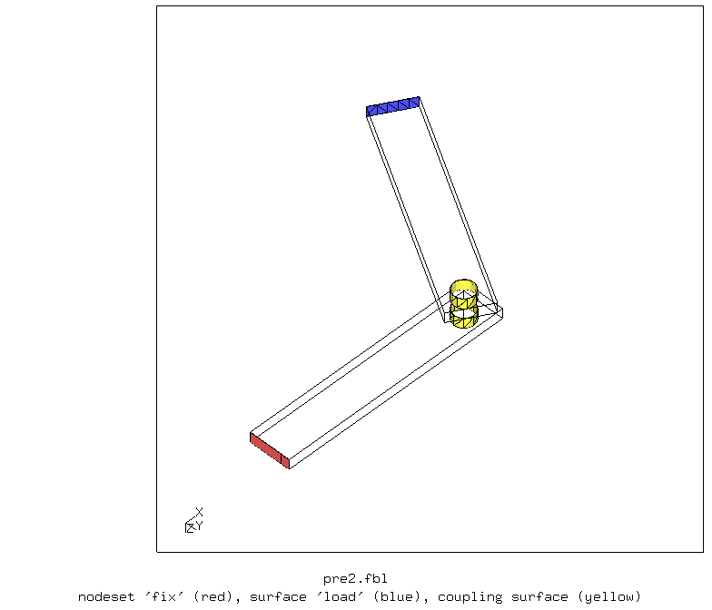
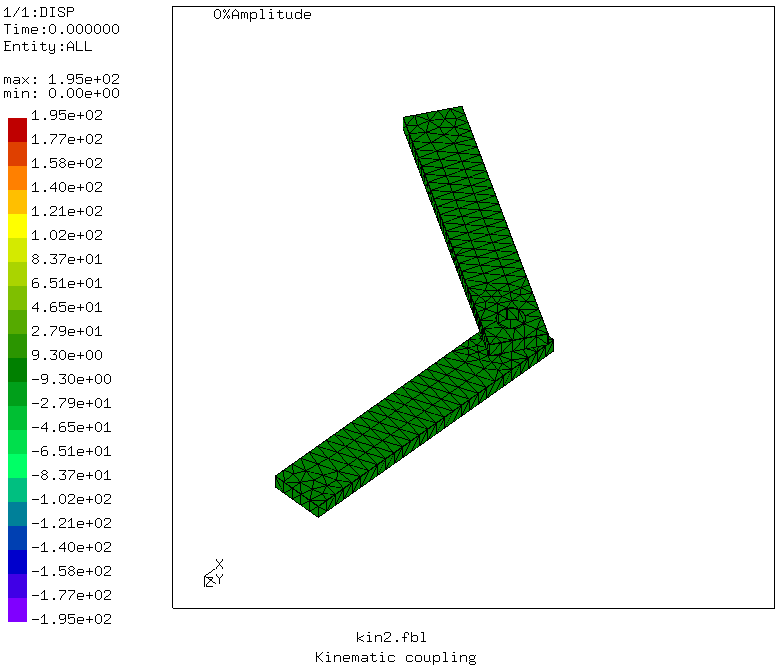
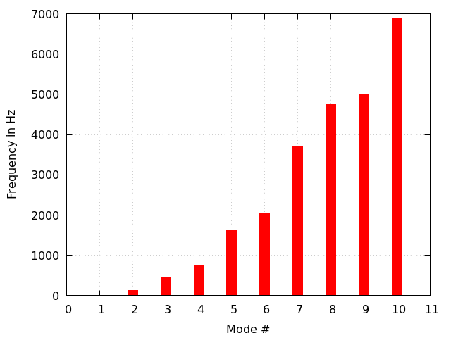
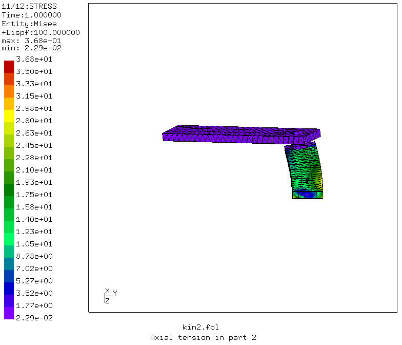
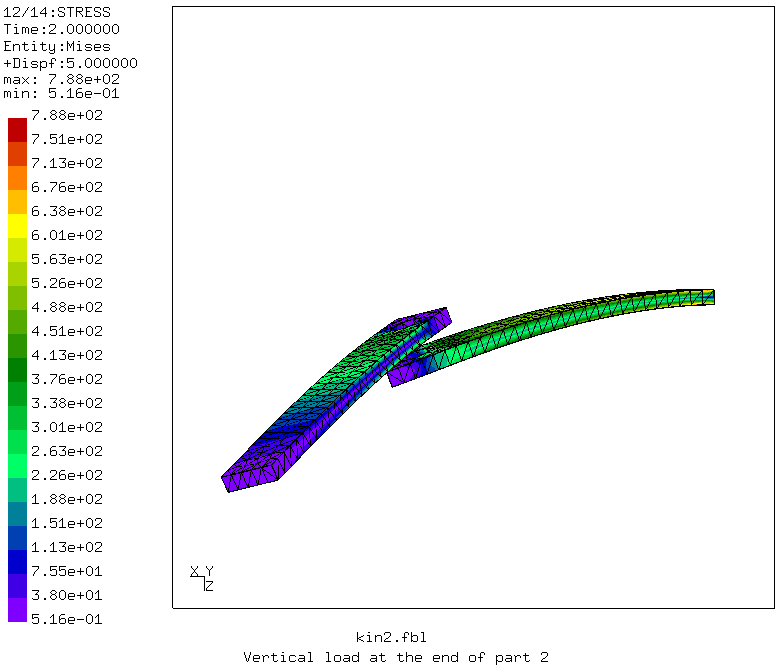

# Test of Joints
Tested with CGX 2.13.1 / CCX 2.13

+ Test of distributing and kinematic coupling
+ Modal analysis
+ Linear static analysis
+ Non-linear static analysis

## Summary:
- Kinematic coupling with cylindrical co-ordinate system and no pin is a convenient and straightforward representation for hinge joints between parts.
- This is restricted to small displacements.
- The radial and axial displacement of the coupling surface follows a rigid body motion

### How to make a hinge

- Define a cylindrical co-ordinate system co-inciding with the axis of the hinge.
- Define a ref node on the axis (the location should be irrelevant, this was not tested)
- Couple the axial and radial motion of the interface surface to the rigid body motion of the ref node.
- You may need to constraint the rotation of the ref node about the axis, although this did not make any difference in the present test.
```
*orientation, name=pin, system=cylindrical
100, 0, 0, 100, 0, 10
*node, nset=nref
6000 , 100, 0, 0
*coupling, ref node= 6000 ,surface= Ss12 ,constraint name=p11, orientation=pin
*kinematic
1
3
```


### Issues
* version with distributing coupling behaves as if the pin was fully constrained.
* version with distributing coupling fails in a nlgeom step
* Segfault with kinematic coupling with pin in nlgeom step
* Segfault destroys already accumulated dat file.


File                          | Contents    
:-------------                | :-------------
[par.pre.fbl](par.pre.fbl)    | CGX script, pre-processing
[par.pre2.fbl](par.pre2.fbl)  | CGX script, pre-processing, pin-less model
[dist.fbl](dist.fbl)          | CGX script, simulation and post-pro with distributing coupling
[kin.fbl](kin.fbl)            | CGX script, simulation and post-pro with kinematic coupling
[kin2.fbl](kin2.fbl)          | CGX script, simulation and post-pro with kinematic coupling and no pin
[solve.inp](solve.inp)        | CCX input for model with pin
[solve2.inp](solve2.inp)      | CCX input for model without pin
[frequency.gpl](surface.gpl)  | Gnuplot script for frequency chart
[test.py](test.py)            | Python script to run the full simulation

The model represents a hinged joint between two bars. The pin is modeled by a beam which is coupled to the cylindrical surfaces of the holes. Pin-free alternative modelling is also demonstrated.


## Pre-Processing for the model with pin

Parameter | Value | Description
:--       | :--   | :--
xh        | 100   | Distance between hinge and end of the bars in mm
rh        | 5     | Radius of the holes in mm
angle     | -60   | Angular position of bar 2 in degrees
dz        | 10    | axial offset between the bars in mm

The script generated the elements, the surface, node and element sets and writes the coupling commands for ccx.
```
> param.py par.pre.fbl
> cgx -b pre.fbl
```


The model is supported by full constraint of the node set `fix` and loaded by a (tensile) pressure to surface `load`.

The coupling pin consists of a center region with nominal diameter connecting the two reference nodes and of two extensions with reduced diameter. These extensions are just there to enforce a knot in the beam nodes, because this is not triggered by using them as referece node.

It should be sufficient to just have the center region, but unfortunately, it is not.


After running `pre.fbl` you find the ccx input files `dpin.inc` and `kpin.inc`, with the commands for distributing and kinematic coupling respectively.

Both versions are used in simulations of three steps:
* frequency analysis
* static analysis without explicit `nlgeom`
* static analysis with explicit `nlgeom`


## Distributing coupling

```
> cgx -b dist.fbl
```
The frequency analysis and the linear static analysis indicate that the pin is not movable at all.


The knot messages in the dat file indicate some problems:
```
KNOT2
tra      5333 -0.5947E-15  0.1546E-15  0.8250E-15
rot         0         NaN  0.1028-320  0.8777-318
exp      5461  0.0000E+00 -0.9328E-14 -0.9328E-14

```

In the linear static step, the lower fixed bar is totally stress free, all the load is taken by the upper reference node (which was not fixed deliberately). There is a message stating that nlgeom is active.


The non-linear static analysis doesn't succeed, CCX stops with the message:

```
STEP            3

Static analysis was selected

Newton-Raphson iterative procedure is active

Nonlinear geometric effects are taken into account

*ERROR in meanrotmpc: MPC has wrong number of terms
```

## Kinematic coupling
The interface surfaces are coupled to separate ref nodes. The ref nodes are connected by the pin with no released degrees of freedom. Thus the structure behaves like a single deformable part.

```
> cgx -b kin.fbl
```
The frequency analysis and the linear static analysis show the expected behaviour.


The frequency chart can't be plotted because the dat-file is empty, perhaps due to the segfault crash.

``

In the linear static step, the lower fixed bar shows bending and twisting load. The upper bar has tensile load, the stresses are much smaller there. This is to be expected because regardles of how the upper bar rotates, the pressure load is always axial.


The non-linear static analysis doesn't succeed, CCX stops with the message:

```
STEP            3

Static analysis was selected

Newton-Raphson iterative procedure is active

Nonlinear geometric effects are taken into account

Determining the structure of the matrix:
number of equations
10939
number of nonzero lower triangular matrix elements
369327

increment 1 attempt 1
increment size= 1.000000e+00
sum of previous increments=0.000000e+00
actual step time=1.000000e+00
actual total time=2.000000e+00

iteration 1

Segmentation fault

```
## Kinematic coupling without pin

The idea is to couple the interface surfaces of both members to the same reference node and restricting the coupling to the axial and radial motion using a custom co-ordinate system. This will allow relative rotation about the axis.

The axis is defined using two points on the axis of rotation.

Another difference to the models above is the use of kinematic coupling for the support.

Steps:
1. frequency analysis
1. static analysis with tension in part 2 without explicit `nlgeom`
1. static analysis with bending in both parts without explicit `nlgeom`
1. as before with explicit `nlgeom`


### Pre-processing

```
> param.py par.pre2.fbl
> cgx -b pre2.fbl
```


### Solving and post-processing

```
> cgx -b kin2.fbl
```
The frequency analysis and the linear static analysis show the expected behaviour.



The frequency chart shows a single zero rigid body mode (f=0). This is the rotation of part 2 about the hinge.



In the first linear static step, the lower fixed bar shows bending and twisting load. The upper bar has tensile load, the stresses are much smaller there. This is to be expected because regardles of how the upper bar rotates, the pressure load is always axial.



In the second step, a vertical force is applied, which induces bending in both parts.



This step is repeated with explicit `nlgeom`. In this case the solution does not converge.
