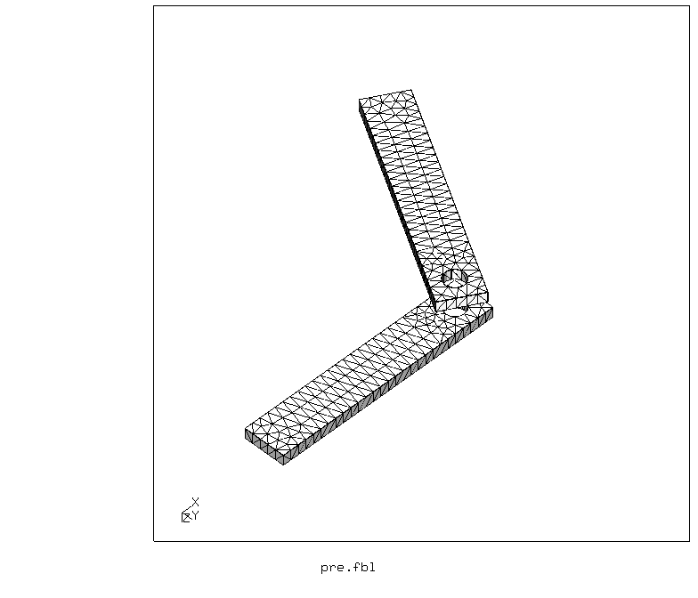
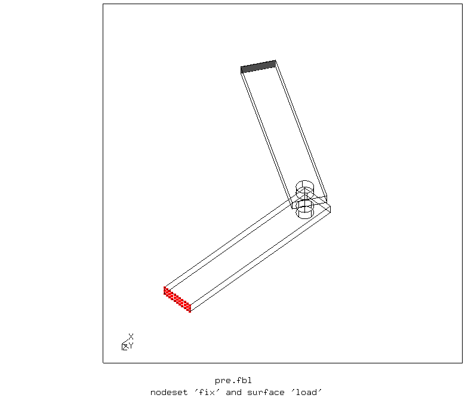
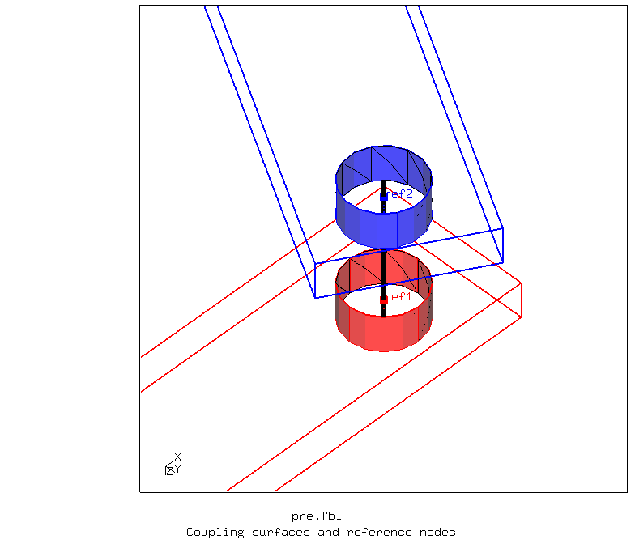
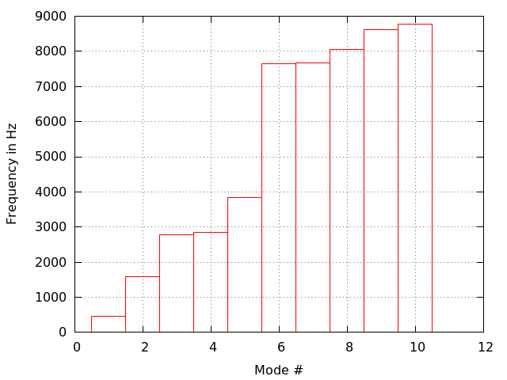
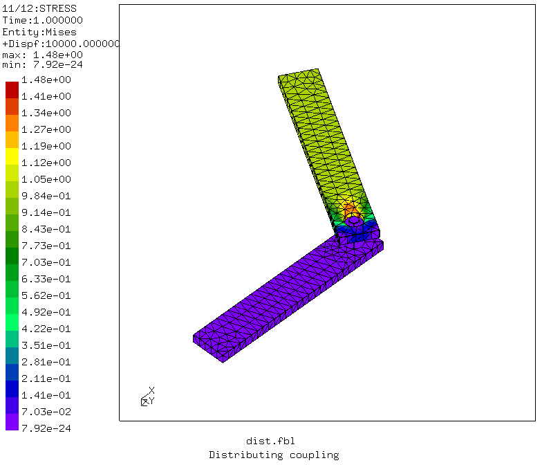
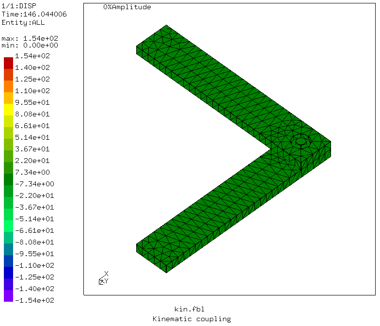
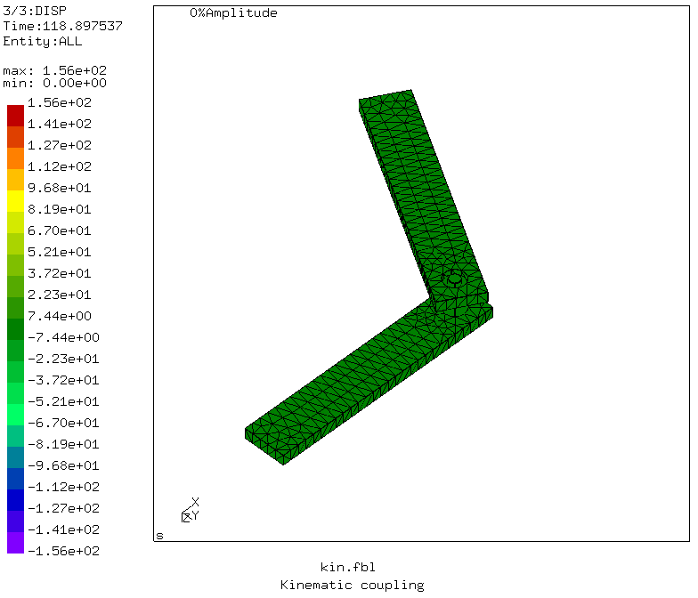
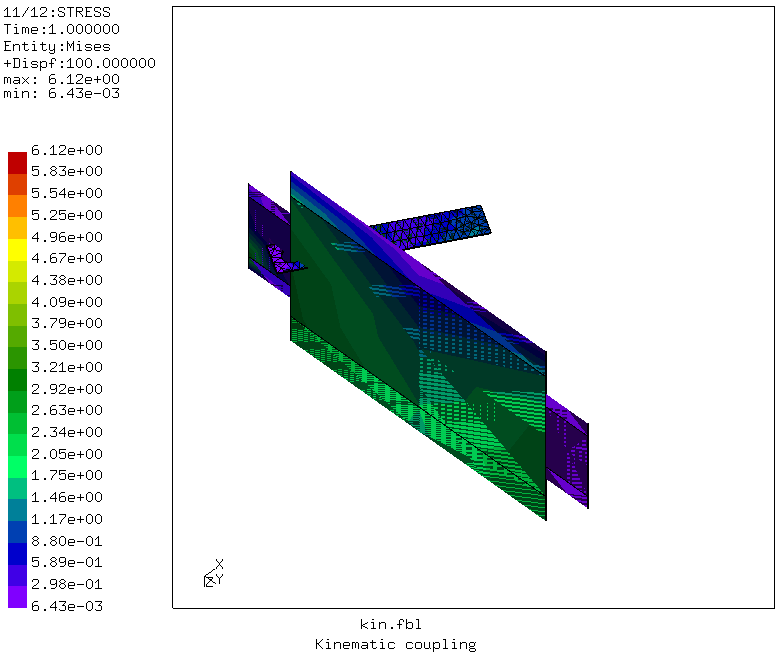

# Test of Joints
Tested with CGX/CCX 2.12

+ Test of distributing and kinematic coupling
+ Modal analysis
+ Linear static analysis
+ Non-linear static analysis

Issues:
* version with distributing coupling behaves as if the pin was fully constrained.
* version with distributing coupling fails in a nlgeom step
* Segfault with kinematic coupling in nlgeom step
* Segfault destroys already accumulated dat file.


File                           | Contents    
 :-------------                | :-------------
 [par.pre.fbl](par.pre.fbl)    | CGX script, pre-processing
 [dist.fbl](dist.fbl)          | CGX script, simulation and post-pro with distributing coupling
 [kin.fbl](kin.fbl)            | CGX script, simulation and post-pro with kinematic coupling
 [solve.inp](solve.inp)        | CCX input
 [frequency.gpl](surface.gpl)  | Gnuplot script for frequency chart

The model represents a hinged (currently without free rotation, i.e. no rigid body dofs in the model) joint between two bars. The pin is modeled by a beam which is coupled to the cylindrical surface of the holes.


## Pre-Processing

The script generated the elements, the surface, node and element sets and writes the coupling commands for ccx.
```
> param.py par.pre.fbl
> cgx -b pre.fbl
```


The model is supported by full constraint of the node set `fix` and loaded by a (tensile) pressure to surface `load`.

The coupling pin consists of a center region with nominal diameter connecting the two reference nodes and of two extensions with reduced diameter. These extensions are just there to enforce a knot in the beam nodes, because this is not triggered by using them as referece node.

It should be sufficient to just have the center region, but unfortunately, it is not.



After running `pre.fbl` you find the ccx input files `dpin.inc` and `kpin.inc`, with the commands for distributing and kinematic coupling respectively.

Both versions are used in simulations of three steps:
* frequency analysis
* static analysis without explicit `nlgeom`
* static analysis with explicit `nlgeom`


## Distributing coupling

```
> cgx -b dist.fbl
```
The frequency analysis and the linear static analysis indicate that the pin is not movable at all.




The knot messages in the dat file indicate some problems:
```
KNOT2
tra      5333 -0.5947E-15  0.1546E-15  0.8250E-15
rot         0         NaN  0.1028-320  0.8777-318
exp      5461  0.0000E+00 -0.9328E-14 -0.9328E-14

```

In the linear static step, the lower fixed bar is totally stress free, all the load is taken by the upper reference node (which was not fixed deliberately). There is a message stating that nlgeom is active.



The non-linear static analysis doesn't succeed, CCX stops with the message:

```
STEP            3

Static analysis was selected

Newton-Raphson iterative procedure is active

Nonlinear geometric effects are taken into account

*ERROR in meanrotmpc: MPC has wrong number of terms
```

## Kinematic coupling

```
> cgx -b kin.fbl
```
The frequency analysis and the linear static analysis show the expected behaviour.



The frequency chart can't be plotted because the dat-file is empty, perhaps due to the segfault crash.

``

In the linear static step, the lower fixed bar is shows bending and twisting load. The upper bar has tensile load, the stresses are much smaller there. This is to be expected because regardles of how the upper bar rotates, the pressure load is always axial.



The non-linear static analysis doesn't succeed, CCX stops with the message:

```
STEP            3

Static analysis was selected

Newton-Raphson iterative procedure is active

Nonlinear geometric effects are taken into account

Determining the structure of the matrix:
number of equations
10939
number of nonzero lower triangular matrix elements
369327

increment 1 attempt 1
increment size= 1.000000e+00
sum of previous increments=0.000000e+00
actual step time=1.000000e+00
actual total time=2.000000e+00

iteration 1

Segmentation fault

```
