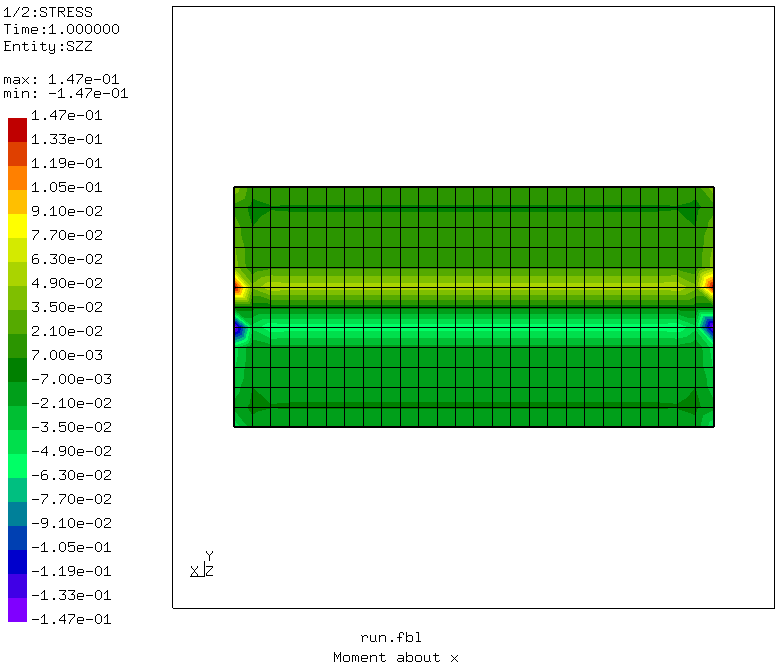
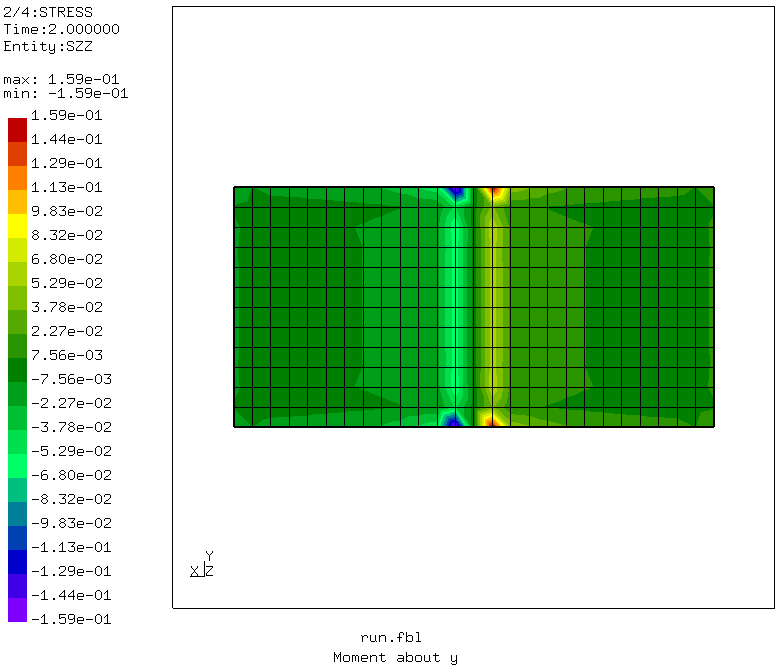
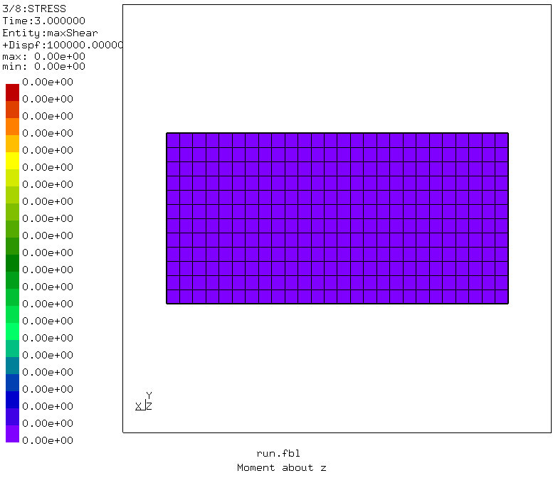
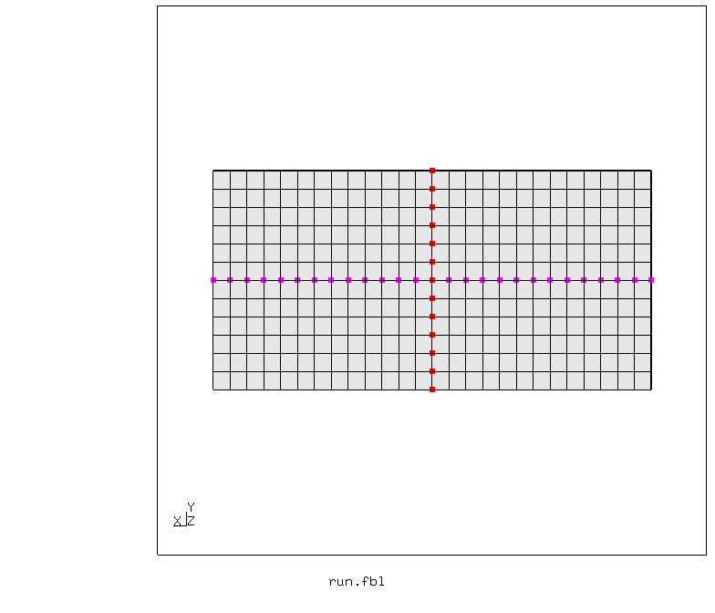
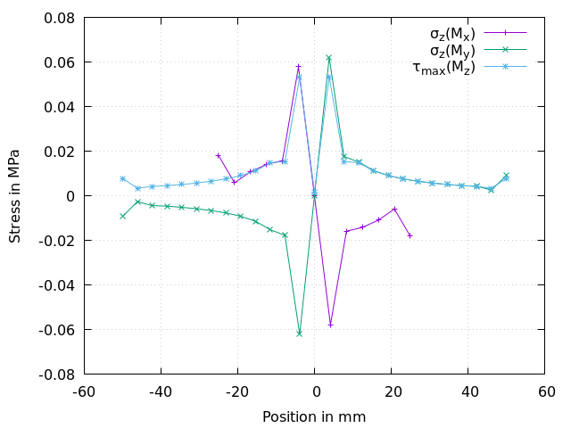

# Stress distribution with mean rotation MPC

Tested with CGX 2.16 / CCX 2.16pre

+ Test of mean rotation multipoint constraints
+ Stress distribution for applied moments
+ Result in version 2.13 and later: Exhibits the same strange (hyperbolic) stress distribution as distributing coupling, plus stress peaks at boundaries and edges due to equal nodal weights. Distributing coupling is area-weighted, thus no artificial peaks.
+ This example doesn't work in CGX 2.14.1 and 2.15.


File                           | Contents    
:-------------                | :-------------
[run.fbl](pre.fbl)            | CGX script, full simulation
[solve.inp](solve.inp)        | CCX input
[path.gpl](path.gpl)          | Gnuplot input for path plots
[test.py](test.py)            | Python script to run the full simulation

## Model description

The model consists of a thin rectangular plate. The bottom at z=0 is fixed (all dofs constrained).
To the upper surface, moments are applied via mean rotation MPC.

The meanrot MPC couples a set of nodes to a reference node:
 - The co-ordinates of the ref node specify the axis of rotation
 - Dof 1 of the ref node specifies the amount of rotation (in radians)

For different load directions, individual MPCs have to be generated. This is a bit cumbersome in CGX, because multiple `send <set> abq mpc <phi> <nx> <ny> <nz>` commands all use the same reference node and file names. To work around this:
- you have to create dummy nodes, `send` then uses the next unused number (but doesn't recognize the generated reference node)
- you have to rename the target node set for MPCs with different angle or direction.

Using `asgn n <number>` is not really a solution because it doesn't work correctly (asgn n 4 produces node numbers 4,8,12...)

For path plots of the stress distribution, appropriate node sets are generated.

## Simulation and Results

The plots of the normal stress show the load distribution for bending moments, the plots of the max shear stress show the load distribution in torsion.
```
> cgx -b run.fbl
```



The stress profiles are hyperbolic with distance from the center of gravity (a linear distribution would be expected). The stress peaks at the corners and at the edge come from equal weight per node (in contrast to surface based distributing coupling, mean rot mpc is not area-aware).


