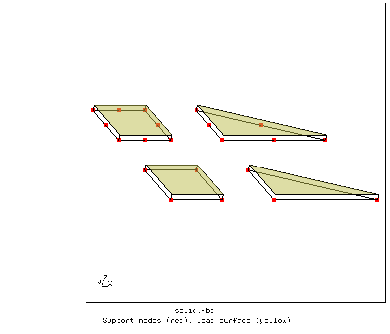
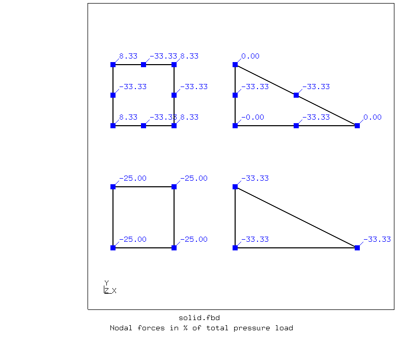

# Nodal Forces From Uniform Pressure
Tested with CGX 2.20 / CCX 2.20

+ Static linear analysis
+ Uniform pressure applied to the upper face of various element shapes
+ Output of RF shows the resulting distribution of the load to the nodes
+ Solid elements must be used in order to separate support nodes from load-affected nodes. Otherwise nodal forces from distributed loads and support reactions would cancel out 


File                       | Contents    
 :-------------            | :-------------
 [run.fbd](run.fbd)        | CGX script for 3D model
 [solve.inp](solve.inp)    | CCX input for 3D model
 [solve_sep.inp](solve_sep.inp)    | CCX input for non-averaged solution (3D-model)
 [run2d.fbd](run2d.fbd)    | CGX script for plane model
 [solve2d.inp](solve2d.inp)    | CCX input for plane model
 [solve2d_sep.inp](solve2d_sep.inp)    | CCX input for non-averaged solution
 [path.gnu](path.gnu)      | Gnuplot control file for the combined path plot (3D)
 [path2d.gnu](path2d.gnu)      | Gnuplot control file for the combined path plot (2D)
 [test.py](test.py)        | Python script to run the simulation


The upper surfaces are loaded with a uniform pressure. 

| Parameter      | Value   | Meaning                                      |
| :------------- |  :----  | :-------------                               |
| `thi`          | 0.1     | thickness, z dimension in m                  |
| `tol`          | 0.01    | tolerance for location-based set definitions |


The parameters are defined in [solid.fbd](solid.fbd) using the `valu` command.

## Solid Model

The model contains linear and quadratic triangular and 
quadrilateral separate elements which are extruded in thickness direction. The lower side is fully constrained.
A uniform pressure of 100 Pa is applied to the top surfaces of the element (1 m²), such that the resultant force is 100. The nodal forces can be read as % of the total force.

| 2D element in CGX      | 3D Element in CCX   | | 
| :-------------         |  :----              |  :----              | 
| tr3         `          | C3D6                | linear wedge element          |
| qu4                    | C3D8                | linear hexaeder               |
| tr6         `          | C3D15               | second order wedge element          |
| qu8                    | C3D20               | second order hexaeder               |



The complete simulation is run by

```
> cgx -b solid.fbd
```

