# Supports using coupling
Tested with CGX 2.16 / CCX 2.15

+ Test of distributing and kinematic coupling
+ Modal analysis
+ Large rotations


File                          | Contents    
:-------------                | :-------------
[pre.fbl](pre.fbl)            | CGX script, pre-processing
[shapes.fbd](shapes.fbd)      | CGX script, post-processing, animation of mode shapes
[anim.fbl](anim.fbl)          | CGX script, time history animation
[post.fbl](post.fbl)          | CGX script, images and surface data plots
[trfix.fbl](trfix.fbl)        | CGX script, images and surface data plots
[solve.inp](solve.inp)        | CCX input for frequency analysis
[trans.inp](trans.inp)        | CCX input for static analysis
[trfix.inp](trfix.inp)        | CCX input for the reference solution
[surface.gpl](surface.gpl)    | Gnuplot script for section data
[test.py](test.py)            | Python script to run the full simulation

The model contains a brick shaped beam with dimensions given by parameters in `pre.fbl`.

Parameters | Value | Description
:--        | :--   | :--
lx         | 100   | Length
ly         | 5     | Thickness
lz         | 10    | Width

Three simulations are set up:

+ Frequency analysis with one end coupled and subjected to various constraints (distributing coupling is used).
+ Multistep static analysis with large rotation. Cantilever beam with the load distributed over the end surface by distributing coupling. Support is applied via kinematic coupling.
+ Reference solution, cantilever beam with nodal constraints at the end surface.

## Pre-Processing

The script generates the elements, the surface sets and the reference nodes.
```
> cgx -b pre.fbl
```
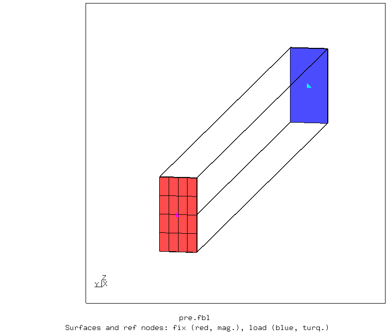

## Frequency analysis

The simulation consists of two frequency steps with different constraints of the reference node:
1. Free (no constraints)
2. Clamped (all dofs constrained)

For each step, 10 mode shapes are stored.
```
> ccx solve
```
Post-Processing
```
> cgx -b shapes.fbd
```
Free (unconstrained reference node).


Clamped (all dofs of the ref node constrained). The constraints are in effect without preventing the end face from deforming.

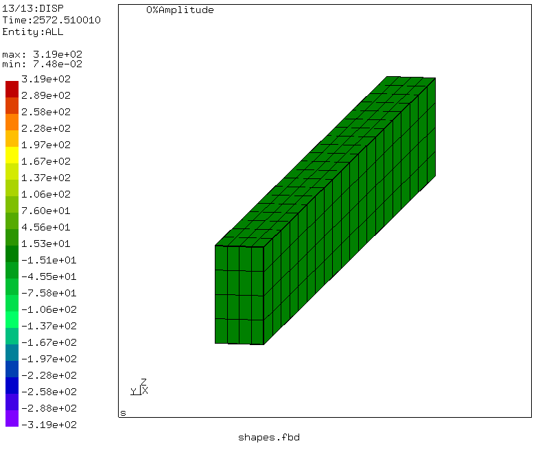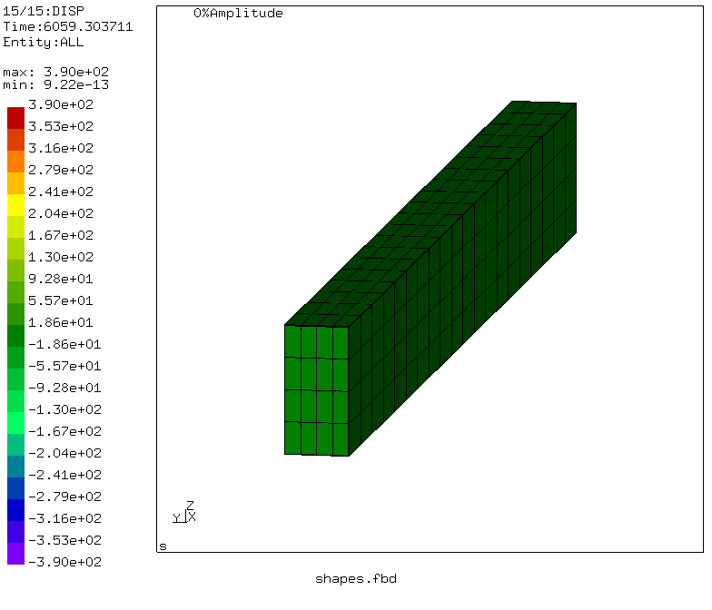


## Multistep static analysis

The simulation consists of a sequence of four steps. The force to the end surface acts always downwards (-z)
+ horizontal position along x, bending about the strong axis
+ 90° rotation about z (no changes in the stress state)
+ 90° rotation about y (longitudinal axis, now bending about the weak axis)
+ rotation to align the beam with the z axis.

The clamp condition is applied as kinematic coupling and the rotations are applied as constraint to the reference node.
A load of 1000 N in negative z-direction is applied via distributing coupling (translation only) to the free end surface.

The rotations are specified by the rotation vector with respect to the initial state. The intermediate states are some non-linear blend between the end states. Here, amplitude generation based on specification of the angular velocity might help.

Observations:
+ The stress state at the support is consistent with full rigid constraint of the nodes, see the reference solution further down.
+ If you switch the coupling dofs at the load application side from 1...3 to 1...6, the simulation still converges but at a much slower rate.


```
ccx trans
monitor.py trans
```
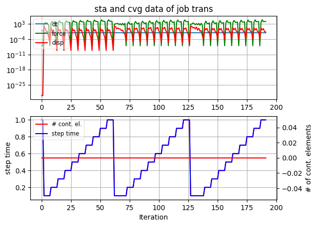

```
cgx -b anim.fbl
```

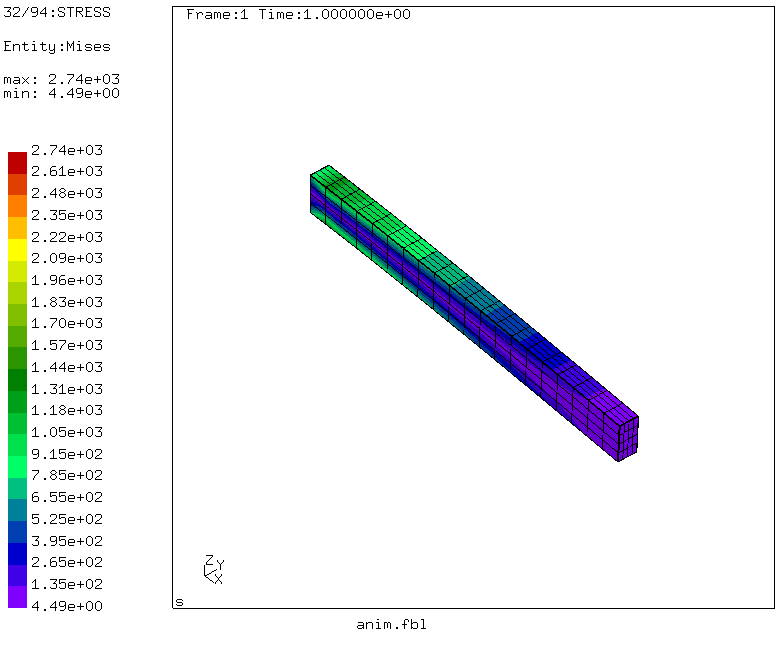


```
cgx -b post.fbl
```
The stress distribution at the support (rigid body constraint by kinematic coupling) is essentially identical to the reference solution (using direct nodal constraints)

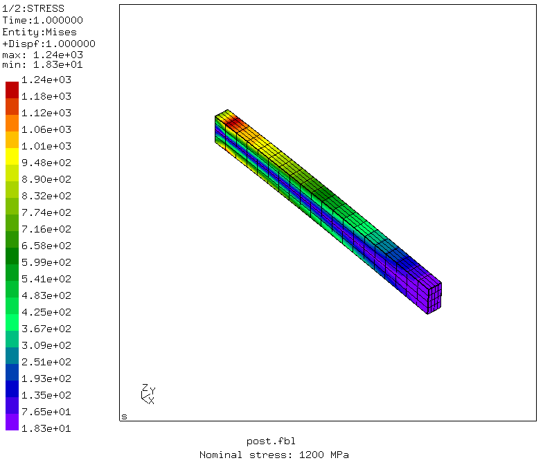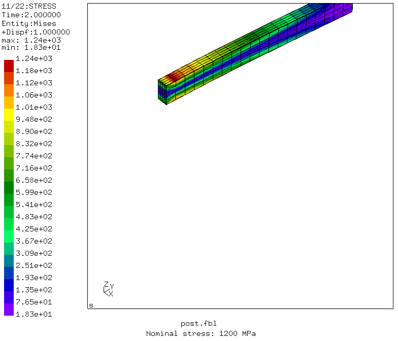
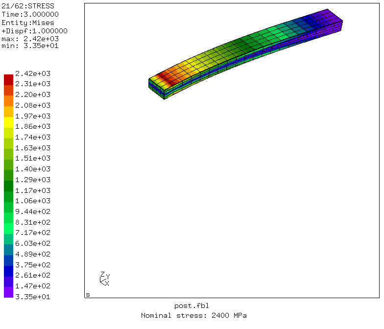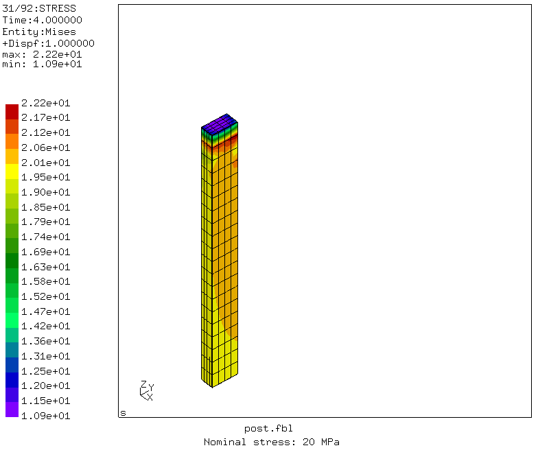

Using the `*section print` command, the surface results (reactions, geometry) are written.

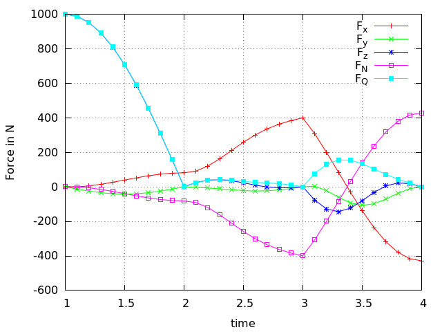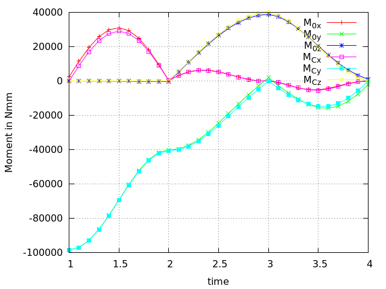

## Reference solution

For comparison a standard clamped cantilever solution is provided.
+ left end is clamped using nodal constraints
+ right end is subjected to a distributed load (distributing coupling) of 1000 N in various directions (x, y, z)
```
ccx trfix
cgx -b trfix.fbl
```

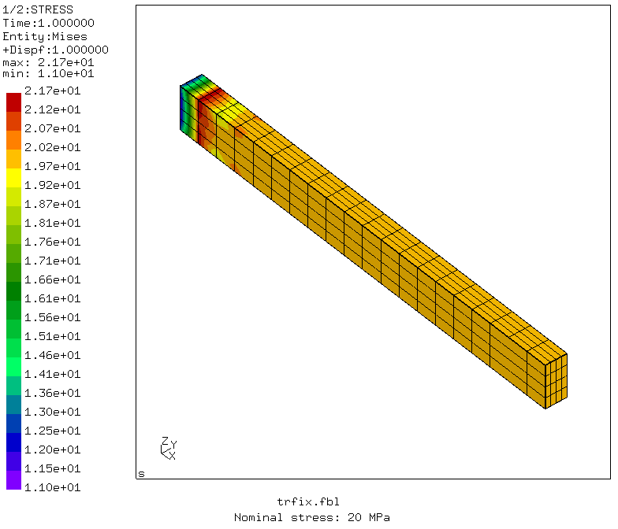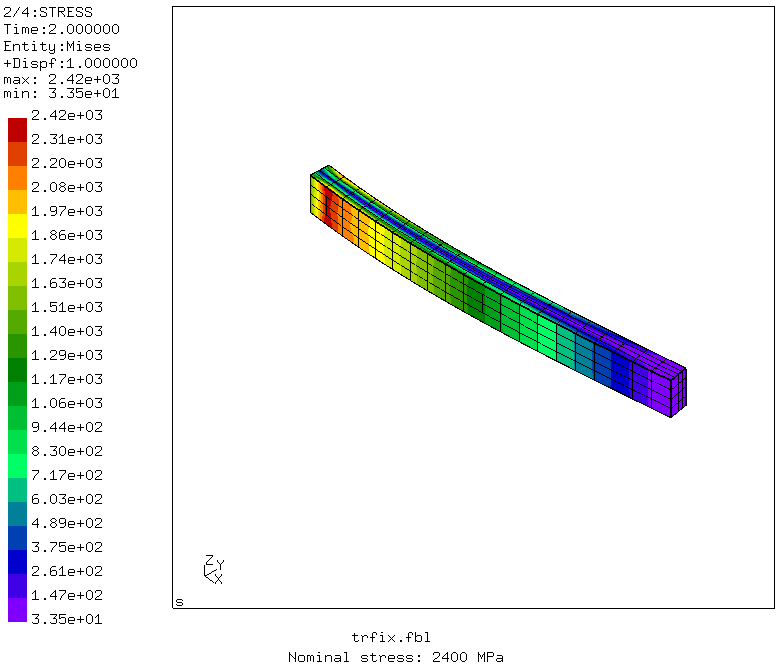
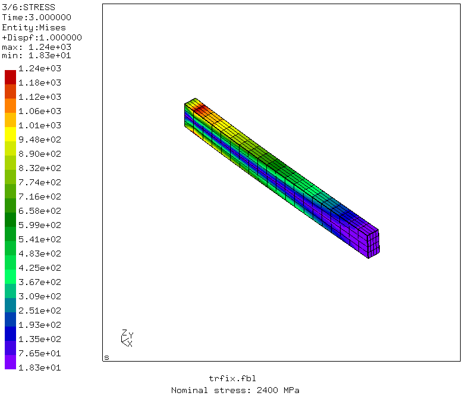

Forces and moments at the support

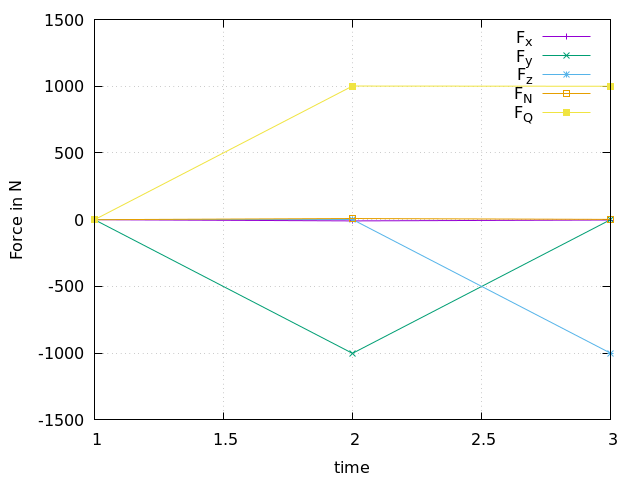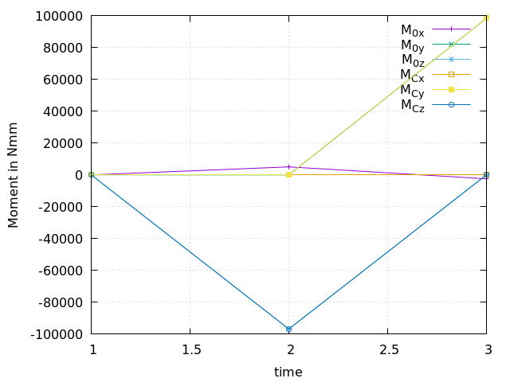
