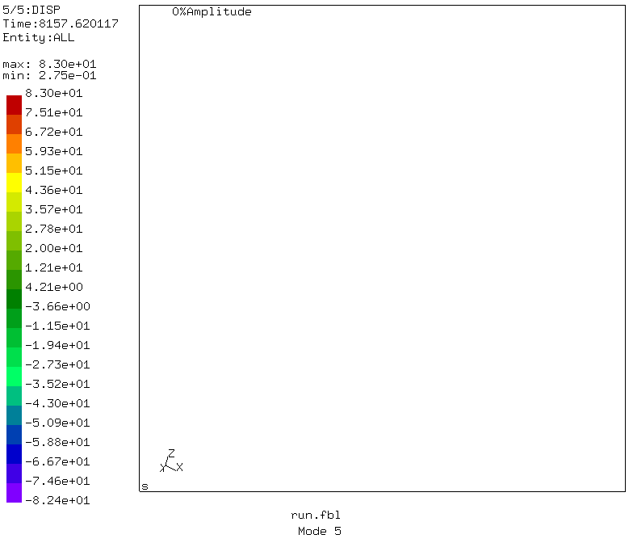
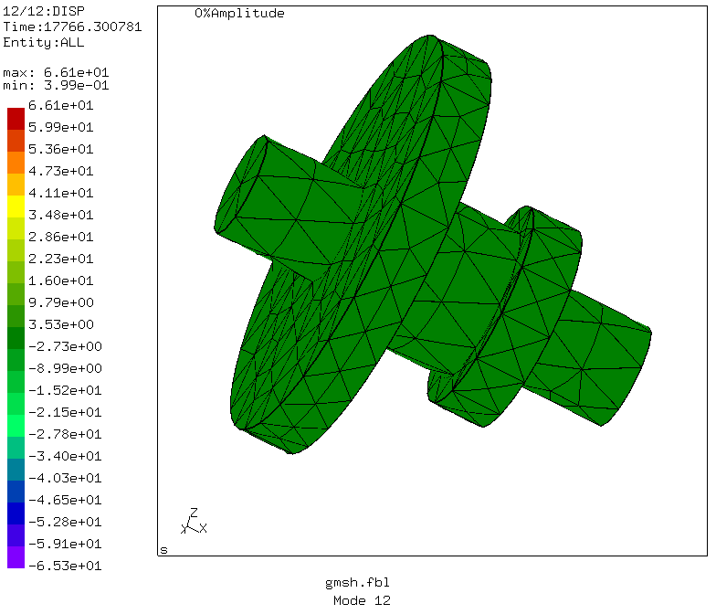
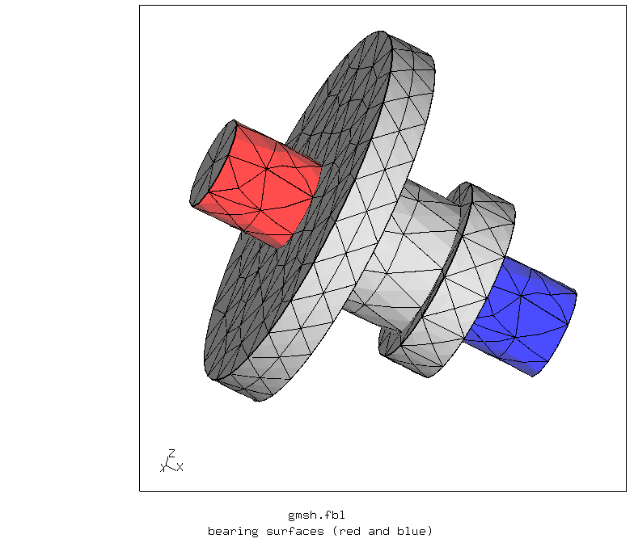

# Supports using distributing coupling
Tested with CGX 2.16 / CCX 2.15 / Gmsh 4.4.1

+ Use of distributing coupling to model bearings of a shaft
+ Modal analysis


File                          | Contents    
:-------------                | :-------------
[Welle.stp](Welle.stp)        | Geometry, STEP format, generated using Autodesk INVENTOR
[Welle.geo](Welle.geo)        | Gmsh script for geometry and mesh
[run.fbl](run.fbl)            | CGX script, meshing with CGX
[gmsh.fbl](gmsh.fbl)          | CGX script, meshing with Gmsh
[test.py](test.py)            | Python script to run the full simulation

The geometry represents a gearbox shaft with bearing journals at the ends. These are modeled using distributing coupling of the cylindrical bearing surfaces. The translations of their centroid is controlled by the displacement of the reference nodes.

Note that this works only for solid elements (not for shells).

```
> cgx -b run.fbl
```


Constraints of the ref nodes

+ red: ux,uy,uz = 0
+ blue: uy, uz = 0


The shaft is free to rotate.


Bending modes rotate about the centers of the bearing surfaces



The left bearing is constrained in longitudinal direction (x), the right one is not. It is clearly visible that the bearing surfaces can deform (which they could not with kinematic coupling)



## Meshing with Gmsh

In CGX 2.12 there was a bug, which resulted in fail of meshing the geometry.
Therefore, an alternative simulation with gmsh as pre-processor has been set up

```
> cgx -b gmsh.fbl
```


