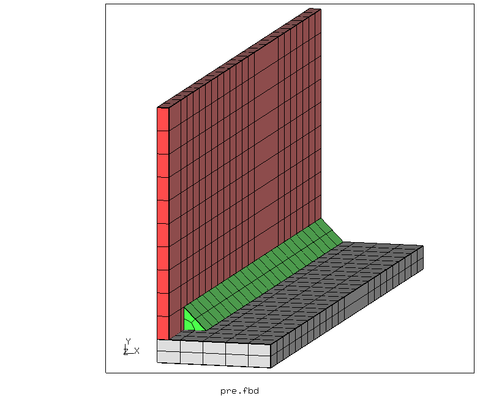
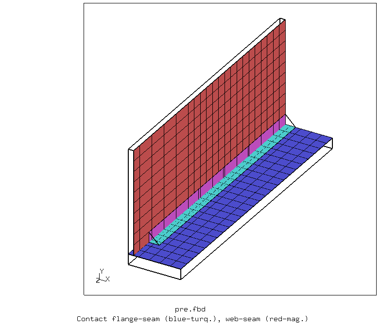
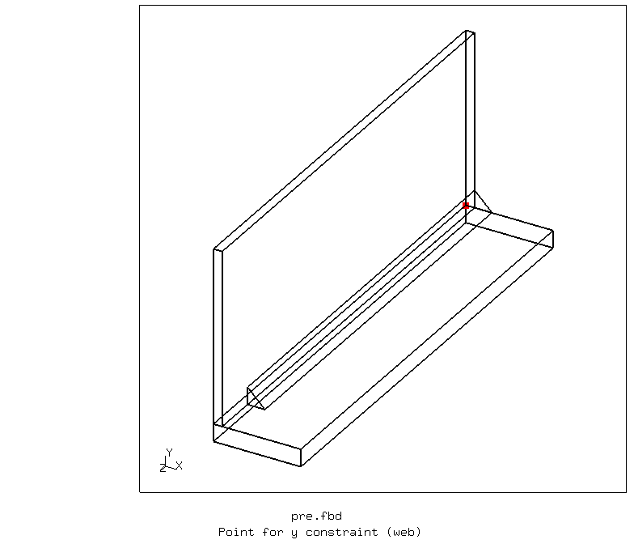
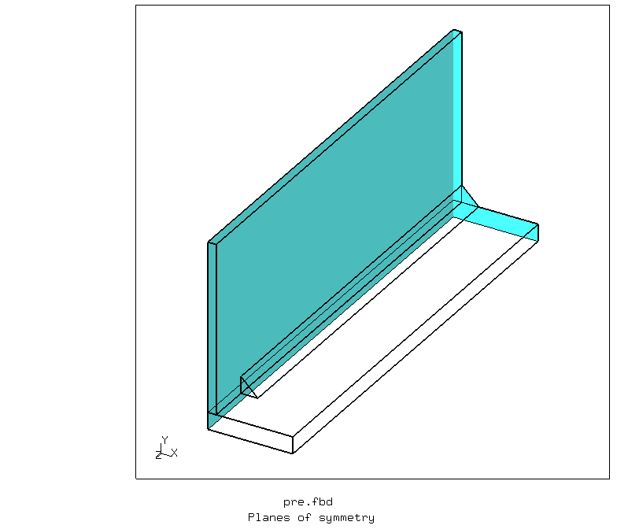
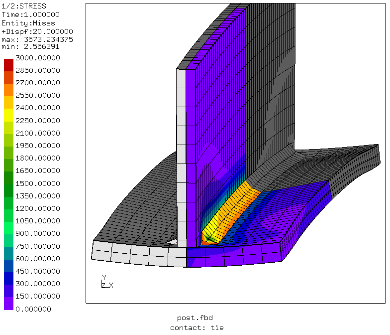
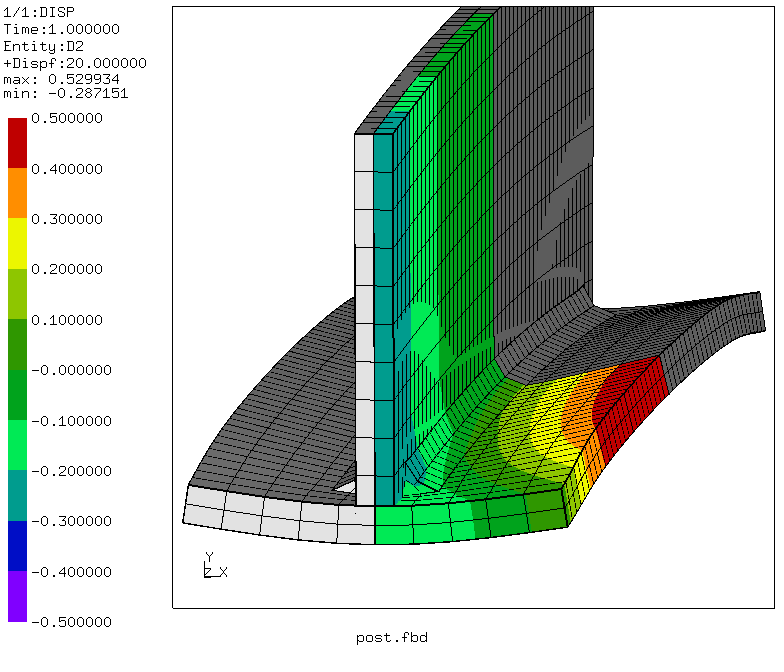
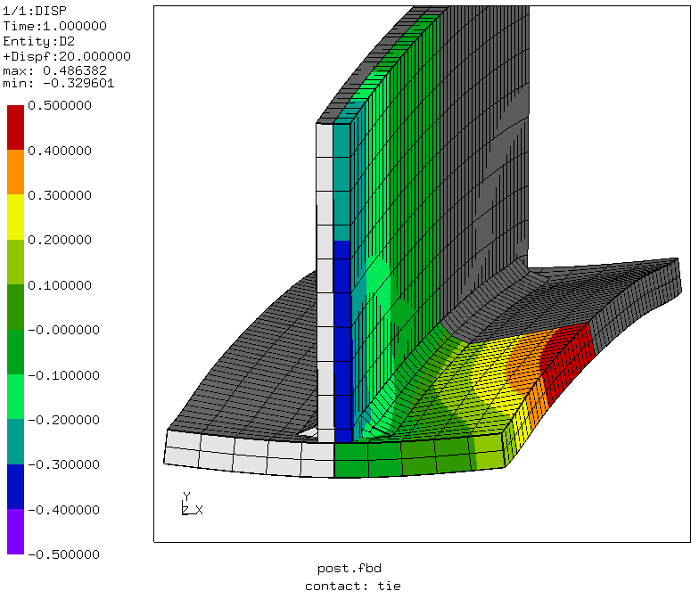

# Shrinkage Model for Welding Distortion
Tested with CGX 2.16 / CCX 2.15

+ Assembly with `*tie` or `*contact pair` connections. Contact version is
selected via parameter `contact` in `pre.fbd.par`.
+ Thermal strain with prescribed temperature
+ Symmetry expansion in post-processing


| File                   | Contents                                      |
| :-------------         | :-------------                                |
| [par.pre.fbd](par.pre.fbd) | Pre-processing with CGX (param.py source file)                 |
| [post.fbd](post.fbd) | Post-processing with CGX                 |
| [pc-ss.inc](pc-ss.inc) | CCX surface-to-surface penalty contact definition |
| [tie.inc](tie.inc)     | CCX MPC contact definition with `*tie`            |
| [Tjoint.inp](Tjoint.inp)     | CCX input          |
| [test.py](test.py])     | Python script to run both contact versions         |

## Preprocessing
Three separate parts are generated.
The following parameters are defined in `pre.fbd.par`

| Parameter      | Value   | Meaning |
| :------------- |  :----  | :------------- |
| `tf`           | 10      | flange thickness in mm |
| `bf`           | 100     | flange width in mm |
| `length`       | 500     | length in mm |
| `tw`           | 10      | web thickness in mm |
| `hw`           | 100     | web height in mm |
| `a`            | 7       | seam thickness in mm |
| `dls`          | 25      | seam offset in mm|
| `contact`      | "pc-ss" | contact version: "pc-ss" (penalty, surface to surface) or "tie" (MPC contact) |


Create the file `pre.fbd` and run the pre-processing
```
> param.py pre.fbd.par
> cgx -b pre.fbd
```
Parts and contact surfaces:



Point for y-constraint and planes of symmetry:




## Solving
```
ccx Tjoint
```
## Postprocessing

```
cgx -b post.fbd
```
Penalty contact is less rigid than MPC contact, thus the maximum equivalent stress for MPC contact is higher.



Vertical displacement


