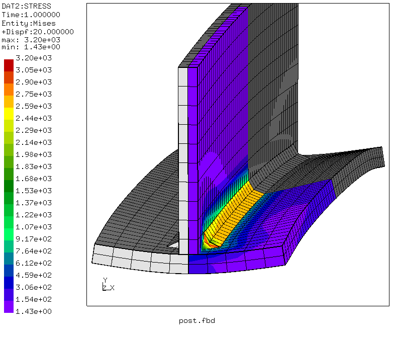
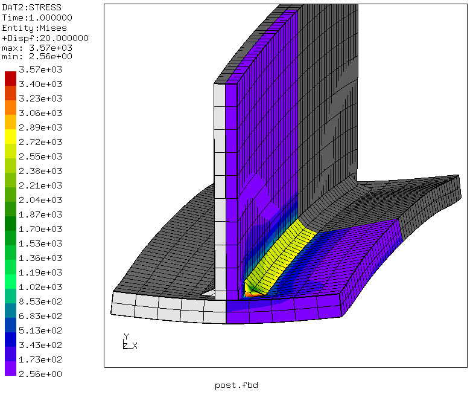

# Shrinkage Model for Welding Distortion
Tested with CGX/CCX 2.12

+ Assembly with `*tie` or `*contact pair` connections. Contact version is
selected via parameter `contact` in `pre.fbd.par`.

+ Thermal strain with prescribed temperature
+ Symmetry expansion in post-processing


| File                   | Contents                                      |
| :-------------         | :-------------                                |
| [par.pre.fbd](par.pre.fbd) | Pre-processing with CGX (param.py source file)                 |
| [post.fbd](post.fbd) | Post-processing with CGX                 |
| [pc-ss.inc](pc-ss.inc) | CCX surface-to-surface penalty contact definition |
| [tie.inc](tie.inc)     | CCX MPC contact definition with `*tie`            |
| [Tjoint.inp](Tjoint.inp)     | CCX input          |

## Preprocessing
Three separate parts are generated.
The following parameters are defined in `pre.fbd.par`
```
# Flange thickness   <tf=10>
# flange width       <bf=100>
# length             <length=500>
# web thickness      <tw=10>
# web heigth         <hw=100>
# seam thickness     <a=7>
# seam offset        <dls=25>
# contact            <contact="pc-ss"> ("pc-ss" or "tie")
```
Create the file `pre.fbd` and run the pre-processing
```
> param.py pre.fbd.par
> cgx -b pre.fbd
```


## Solving
```
ccx Tjoint
```
## Postprocessing

```
cgx -b post.fbd
```
Penalty contact is less rigid than MPC contact, thus the maximum equivalent stress for MPC contact is higher.



