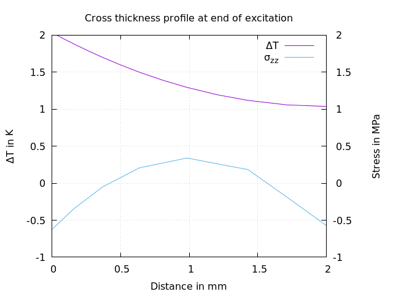
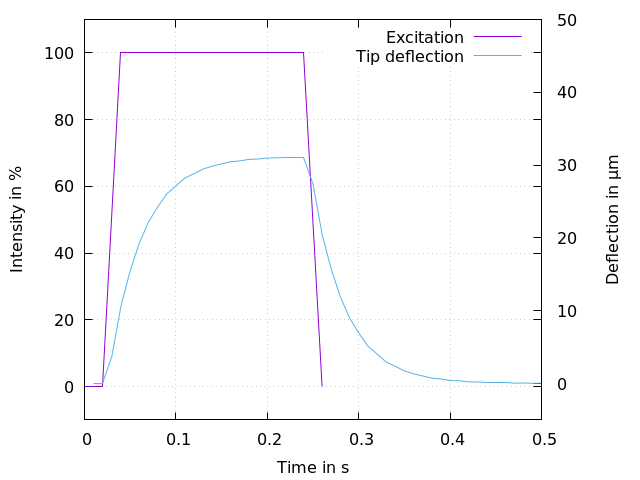
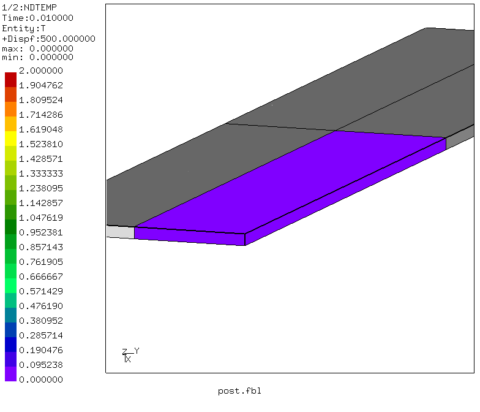
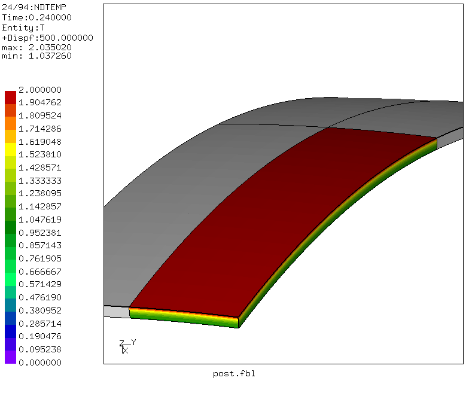
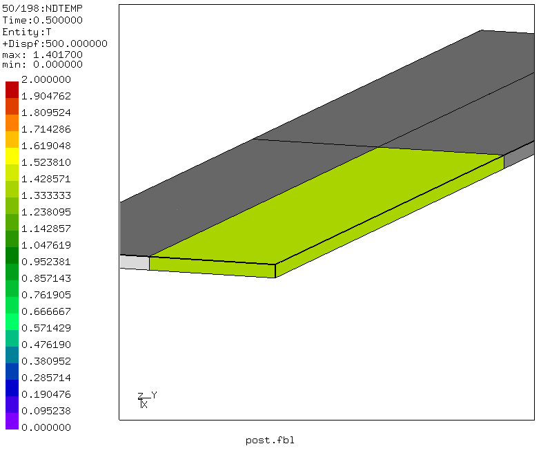
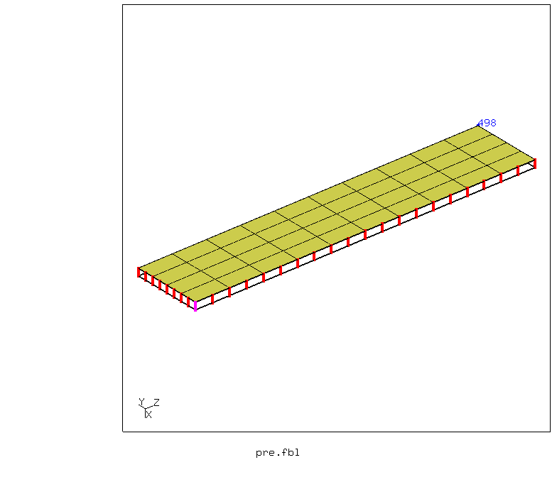
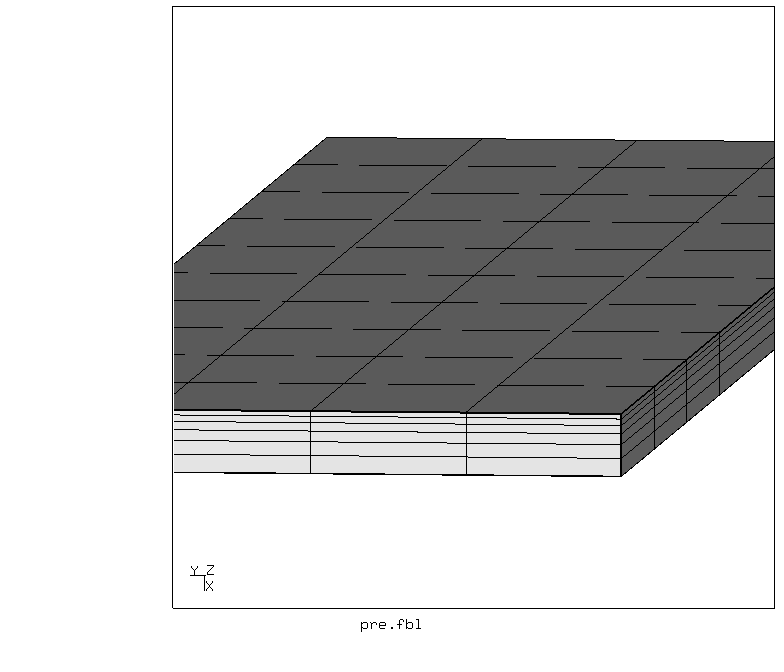
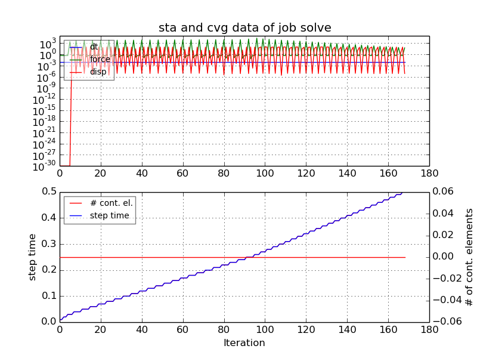
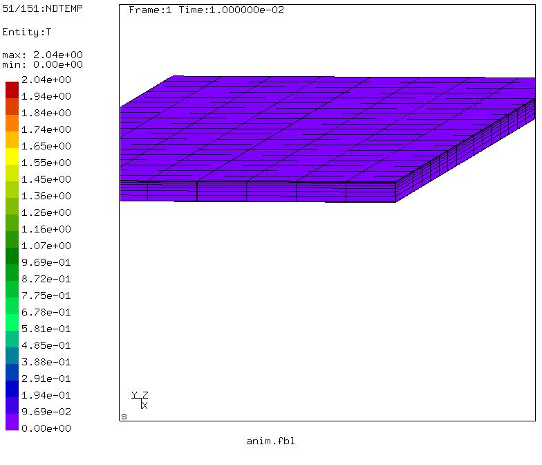

# Thermal Strain
Tested with CGX/CCX 2.11

+ Transient coupled thermo-mechanical analysis
+ Bending of a plate due to one-sided heating
+ Time history excitation and deflection plot
+ Cross thickness temperature and stress plot

File                       | Contents    
 :-------------            | :-------------
 [pre.fbl](pre.fbl)        | CGX script, pre-processing
 [solve.inp](solve.inp)    | CCX input
 [post.fbl](post.fbl)      | CGX script, post-processing, images and plots
 [anim.fbl](anim.fbl)      | CGX script, movie
 [history.gnu](history.gnu)| Gnuplot script for the time history plot
 [profile.gnu](profile.gnu)| Gnuplot script for the profile plot

The model represents a rectangular plate, which is supported in the center and exposed to a transient heat flux (excitation) at the upper side.

A cross-thickness temperature and stress gradient develops and remains for the duration of
the excitation time, leading to transient bending of the plate.









## Pre-Processing
```
> cgx -b pre.fbl
```
The simulation domain is restricted to one quarter of the plate due to symmetry. It is meshed with 6 layers of C3D20R elements with cross thickness bias to capture the high gradients at the excitation side.

A set with a single node at the vertex of the plate is defined for history plot generation.

A node set marking a cross section path for plotting temperature and stress profiles is also defined.




## Solving

The analysis is done with the `*coupled temperature-displacement` procedure using
fixed time increments. During the excitation (approx. half of the total time), the convergence
is slightly slower than afterwards.
```
> ccx solve
> monitor.py solve
```




## Post-Processing

Create a time history animation of the deformed shape colored by the temperature:
```
> cgx -b anim.fbl
```


```
> cgx -b post.fbl
```
creates the images used in the introduction above:
 1. a time history plot of the excitation intensity and the deflection of the plate tip
 2. a cross section temperature and stress profile plot
 4. Images of initial and final state and of the state at the end of the excitation.
