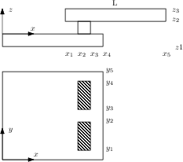
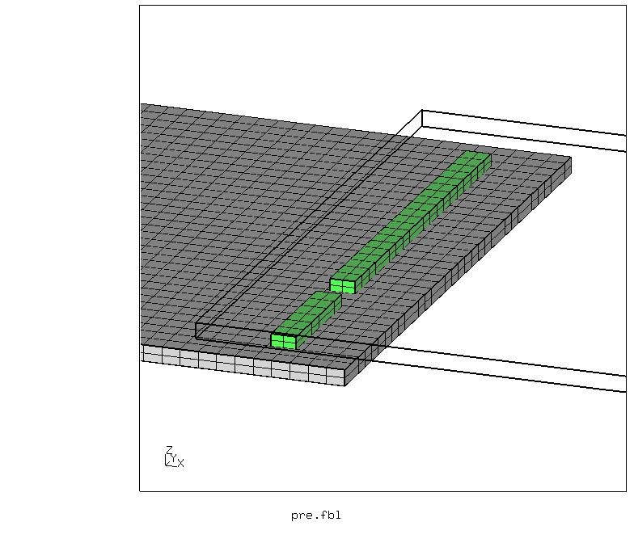
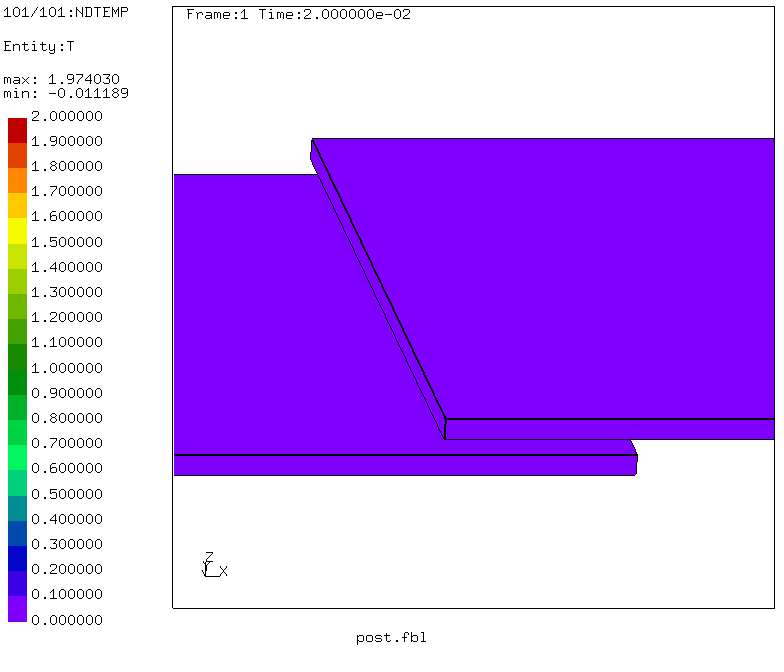
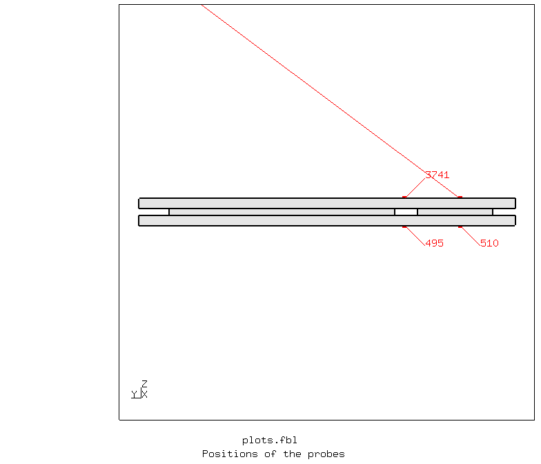
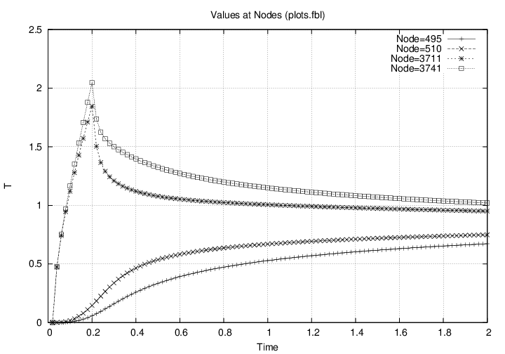
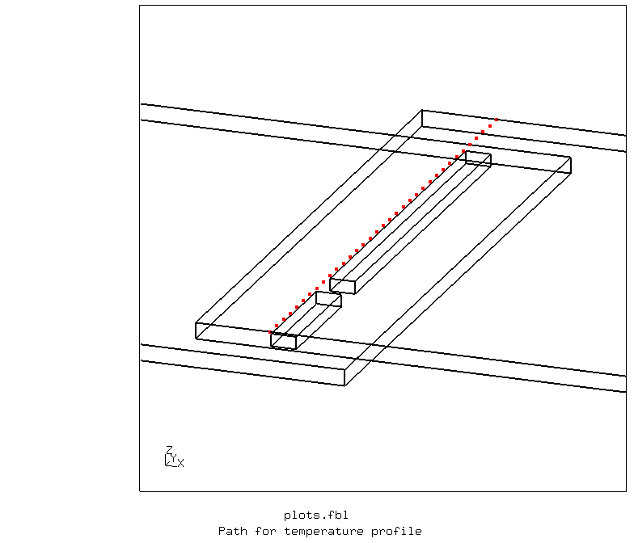
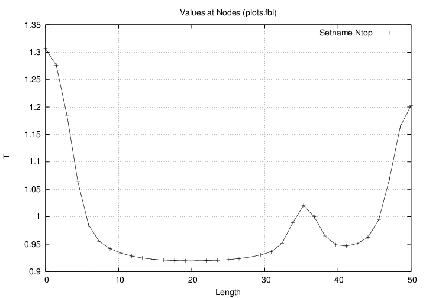

# Thermographic Testing
Tested with CGX 2.16 / CCX 2.15

+ Transient thermal analysis
+ Thermal coupling between independent meshes by `*equation`
+ Heat impulse applied using `*amplitude`
+ Time history plot
+ Path plot (temperature profile)

File                       | Contents    
 :-------------            | :-------------
 [values.fbl](values.fbl)  | CGX script, parameter values
 [pre.fbl](pre.fbl)        | CGX script, pre-processing
 [post.fbl](post.fbl)      | CGX script, post-processing, images and movie
 [plots.fbl](plots.fbl)    | CGX script, post-processing, history and path plots
 [Naht.inp](Naht.inp)      | CCX input
 [test.py](test.py)        | Python script to run the simulation

The model represents an overlap laser weld with a fault (interruption, gap). Such gaps can't be found by visual inspection, as they look like perfect welds from both sides.

A method to detect such faults is thermographic testing with heat impulse excitation (e.g. by induction, by pressurized air or by flash light).

## Pre-Processing
The geometry consists of four bricks which are independently meshed.




| Parameter      | Value   | Meaning                                     |
| :------------- |  :----  | :-------------                              |
| `L`            | 50      | Length of the parts in mm                   |
| `B`            | 50      | width of the parts in mm                    |
| `T1`           | 1.3     | thickness of the lower part in mm           |
| `T2`           | 1.3     | thickness of the upper part in mm           |
| `Gap`          | 1       | distance (gap) between the parts in mm      |
| `o1`           | 5       | lower edge offset in mm                     |
| `o2`           | 5       | upper edge offset in mm                     |
| `NB`           | 2       | seam width in mm                            |
| `y1`           | 3       | start position of the seam                  |
| `l1`           | 10      | length of the first seam segment in mm      |
| `lg`           | 3       | length of the fault (interruption) in mm    |
| `l2`           | 30      | length of the second seam segment in mm     |

You may edit the file [values.fbl](values.fbl) and then run
```
> cgx -b pre.fbl
```
Thermal contact is established via equations, which essentialy establish tied contact. The equations are generated by CGX using lines of the type
```
send <dep> <indep> abq areampc t
```
## Solving

```
> ccx Naht
```

## Post-Processing

```
> cgx -b post.fbl
```


The command
```
> cgx -b plots.fbl
```
creates
 1. a time history plot at four probe positions and
 2. a temperature profile at t=2s

### Time history plot
The probes are located at the center of the first seam segment and of the fault (gap), on the top (excitation) and on the bottom side. These locations are computed from the geometric parameters of the model.





### Path plot (temperature profile)

The temperature profile along the seam at the top side is plotted. The Path is defined by the node set `top`




