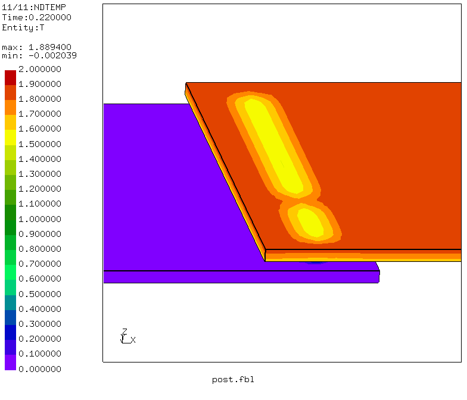

# Thermographic Testing
Tested with CGX 2.10 / CCX 2.9

+ Transient thermal analysis
+ Thermal coupling between independent meshes by `*equation`
+ Heat impulse applied using `*amplitude`

File                       | Contents    
 :-------------            | :-------------
 [values.fbl](values.fbl)  | CGX script, parameter values
 [pre.fbl](pre.fbl)        | CGX script, pre-processing
 [post.fbl](post.fbl)      | CGX script, post-processing
 [Naht.inp](Naht.inp)      | CCX input

The model represents an overlap laser weld with a fault (interruption, gap). Such gaps can't be found by visual inspection, as they look like perfect welds from both sides.

A method to detect such faults is thermographic testing with heat impulse excitation (e.g. by induction, by pressurized air or by flash light).

## Pre-Processing
The geometry consists of four bricks which are independently meshed.


You may edit the file [values.fbl](values.fbl) and then run
```
> cgx -b pre.fbl
```
Thermal contact is established via equations, which essentialy establish tied contact. The equations are generated by CGX using lines of the type
```
send <dep> <indep> abq areampc t
```
## Solving

In order to avoid inconsistent use of the individual scripts, top level script files are provided, which contain the calls to pre-processing, solving and post-processing.
```
> ccx Naht
```

## Post-Processing

```
> cgx -b post.fbl
```


