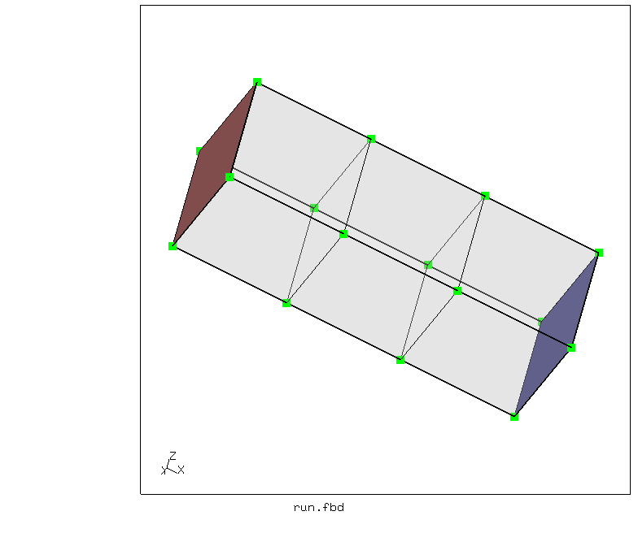
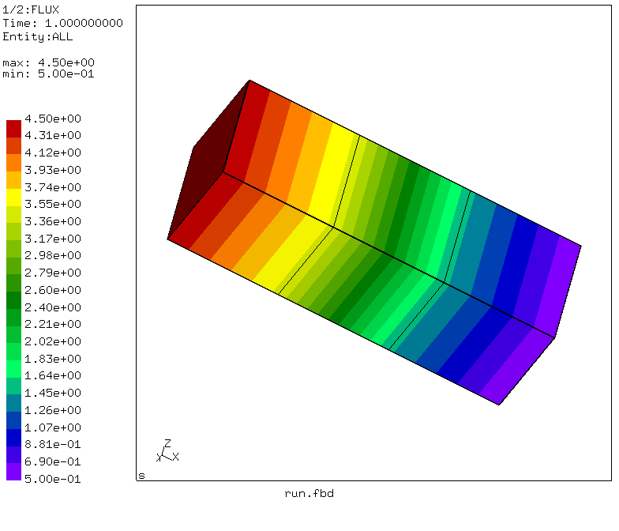
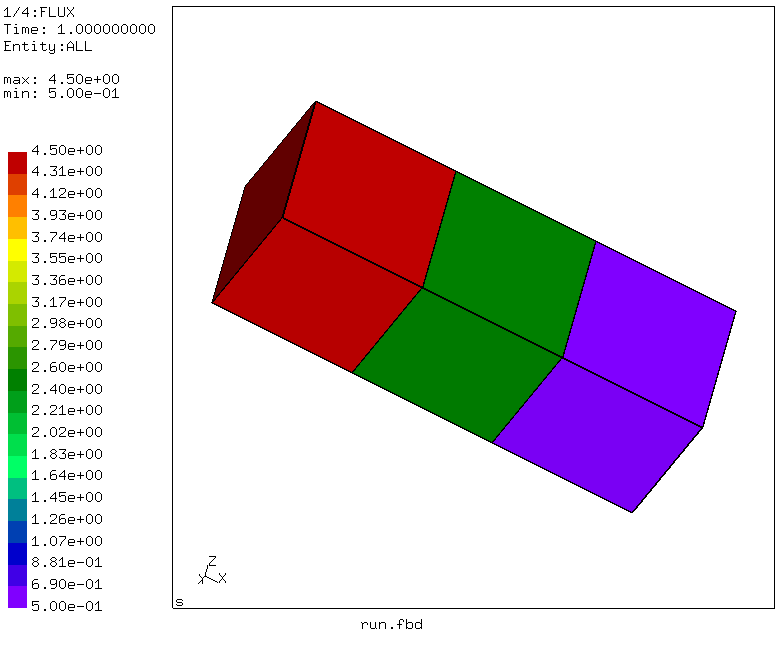
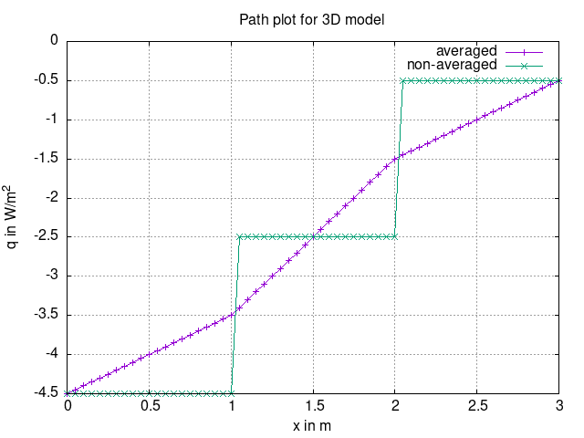
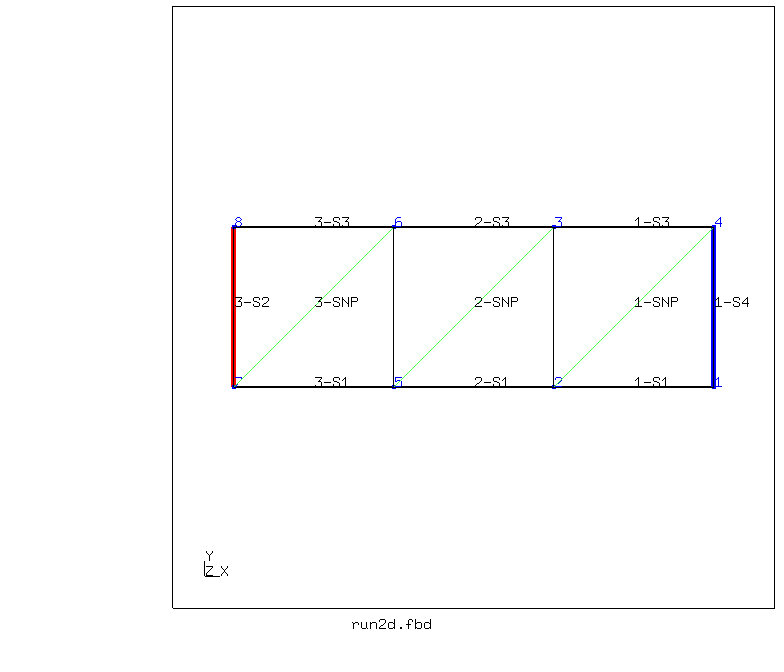
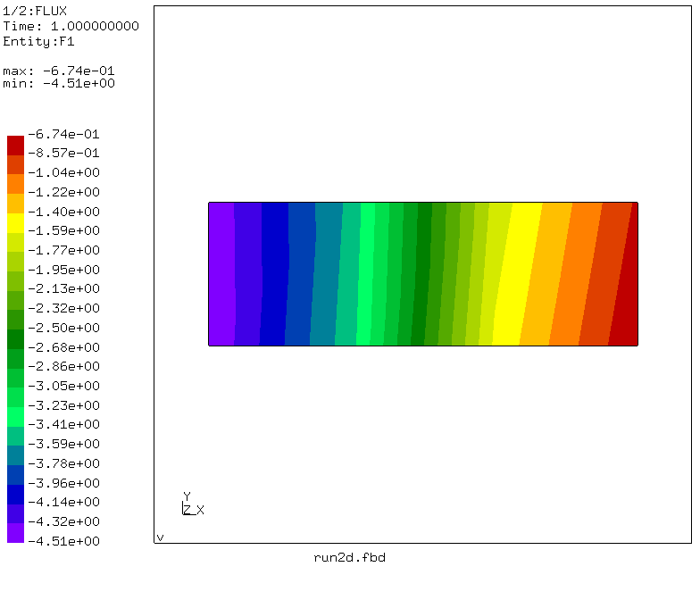
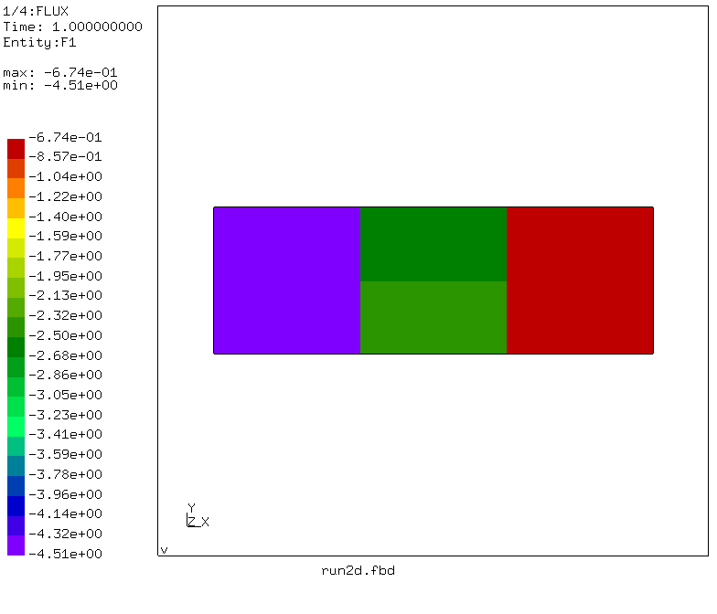
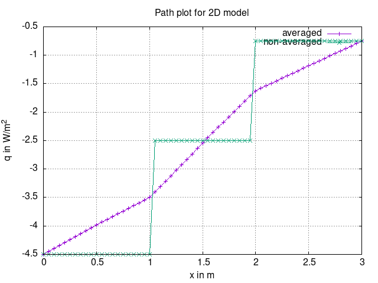

# Steady State Heat Conduction
Tested with CGX 2.20 / CCX 2.20

+ Steady state thermal analysis
+ Prescribed volumentric heat production, isothermal boundary and prescribed flux density
+ Comparison of averaged and non-averaged nodal solution

File                       | Contents    
 :-------------            | :-------------
 [run.fbd](run.fbd)        | CGX script for 3D model
 [solve.inp](solve.inp)    | CCX input for 3D model
 [solve_sep.inp](solve_sep.inp)    | CCX input for non-averaged solution (3D-model)
 [run2d.fbd](run2d.fbd)    | CGX script for plane model
 [solve2d.inp](solve2d.inp)    | CCX input for plane model
 [solve2d_sep.inp](solve2d_sep.inp)    | CCX input for non-averaged solution
 [path.gnu](path.gnu)      | Gnuplot control file for the combined path plot (3D)
 [path2d.gnu](path2d.gnu)      | Gnuplot control file for the combined path plot (2D)
 [test.py](test.py)        | Python script to run the simulation

The model represents a uniform bar for demonstration of 1D steady state heat conduction

| Parameter      | Value   | Meaning                                     |
| :------------- |  :----  | :-------------                              |
| `lx`           | 3       | x dimension in m                            |
| `ly`           | 1       | y dimension in m                            |
| `lz`           | 1       | z dimension in m                            |
| `T0`           | 1       | Prescribed temperature at x=0 in °C         |
| `qL`           | 0.5     | Prescribed heat flux density at x=L in W/m² |
| `pr`           | 2       | Volumetric heat production in W/m³          |


The parameters are defined in [run.fbd](run.fbd) and [run2d.fbd](run2d.fbd)


## 3D Solid Model
The geometry consists of a hexaeder. It is meshed with 3 C3D8 elements.



```
> cgx -b run.fbd
```
The script does the following
- Create geometry and mesh
- Write set definitions
- Produce a mesh plot
- Run the averaged solution
- Create q contour plot and path plot
- Call `separate.py` and run the non-averaged solution
- Create q contour plot and path plot
- Create the combined plot






## 2D Plane Model
The geometry consists of a quadrilateral in the xy plane. It is meshed with 3 CPS4 plane stress elements, which are expanded into 3 C3D8 elements.



```
> cgx -b run2d.fbd
```
The script does the following
- Create geometry and mesh
- Write set definitions
- Produce a mesh plot
- Run the averaged solution
- Create q contour plot and path plot
- Call `separate.py` and run the non-averaged solution
- Create q contour plot and path plot
- Create the combined plot




